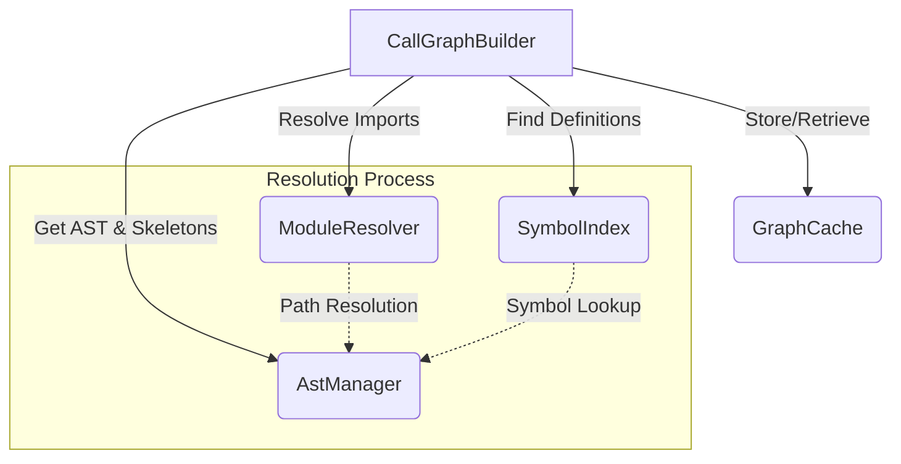

# ADR-016: Impact Flow Analysis & Call Graph Visualization

## Status
Proposed → Ready for Implementation → **Phase 1 Implemented (Dec 2025)**

### Phase 1 Delivery Snapshot
- ✅ `CallGraphBuilder` 구현: `SymbolIndex` + `ModuleResolver` + Tree-sitter call metadata를 결합하여 심볼 간 호출/피호출 그래프를 생성하며, import alias·default export까지 해석합니다.
- ✅ `analyze_symbol_impact` MCP 툴: `symbolName`, `filePath`, `direction(upstream|downstream|both)`, `maxDepth`를 입력으로 받아 호출 그래프와 방문 노드 목록, `truncated` 플래그를 JSON으로 반환합니다.
- ✅ 캐시 무결성: 파일 쓰기, edit/batch_edit, undo/redo, index rebuild/invalidations 시 CallGraphBuilder 캐시를 자동으로 무효화하여 최신 영향도를 보장합니다.

```json
{
  "tool": "analyze_symbol_impact",
  "arguments": {
    "symbolName": "computeTotal",
    "filePath": "services/cart.ts",
    "direction": "both",
    "maxDepth": 3
  }
}
```

## Context

현재 smart-context-mcp는 파일 레벨의 의존성 분석(`DependencyGraph`)과 심볼 참조 검색(`ReferenceFinder`)을 제공하지만, 코드 수정 시 **전체 영향 범위를 파악하기 어렵다**는 한계가 있습니다.

### 현재 시스템의 강점 (활용 가능한 기반)

| 컴포넌트 | 현재 상태 | ADR-016 활용 방안 |
|----------|----------|------------------|
| `DependencyGraph` | ✅ 파일 레벨 의존성, transitive deps 지원 | Call graph의 파일 스코핑에 활용 |
| `SymbolIndex` | ✅ 심볼 검색/캐싱 완비 | 함수 정의 위치 빠른 조회 |
| `ModuleResolver` | ✅ import 경로 해석, tsconfig paths 지원 | 호출 대상 함수의 원본 파일 추적 |
| `ReferenceFinder` | ✅ 심볼 참조 검색, alias 처리 | Upstream caller 탐색에 재사용 |
| `SkeletonGenerator` | ✅ Tree-sitter 쿼리 인프라 | call_expression 쿼리 확장 |
| `analyze_impact` (MCP Tool) | ⚠️ 파일 레벨만 | 심볼 레벨로 확장 필요 |

### 현재 시스템의 한계

1. **파일 레벨 분석만 제공**: `A.ts → B.ts` 관계는 알 수 있지만, 특정 함수가 어떤 호출 체인을 형성하는지 파악 불가
2. **단순 참조 검색**: "어디서 사용되는가"만 알려주고, "어떻게 데이터가 흐르는가"는 제공하지 않음
3. **영향도 예측 불가**: 함수 수정 시 간접적으로 영향받는 코드(downstream dependencies) 파악 어려움
4. **Agent 컨텍스트 부족**: AI Agent가 리팩토링 시 전체 영향 범위를 탐색하는 데 많은 토큰과 시간 소모
5. **call_expression 미추출**: `SkeletonGenerator`에 함수 호출 추출 쿼리가 없어 callee 정보 수집 불가

### 사용자 시나리오

**시나리오 1: 함수 리팩토링**
```typescript
// services/pricing.ts
function calculatePrice(item: Item): number {
  // 이 함수를 수정하면 어디까지 영향이 가는가?
}
```

기존 방식:
- "Find References" → 직접 호출하는 3개 파일만 표시
- 그 3개 파일이 다시 어디서 호출되는지는 수동으로 탐색 필요

**시나리오 2: Breaking Change 예측**
```typescript
// API 응답 타입 변경
interface PriceResponse {
  amount: number;
  currency: string; // 새로 추가
}
```

기존 방식:
- 타입 에러는 컴파일러가 잡지만, 런타임 로직 영향도는 수동 분석 필요
- 이 타입을 사용하는 모든 함수 체인을 일일이 추적해야 함

### 기존 도구와의 비교

| 도구 | 제공 기능 | 한계 |
|------|----------|------|
| VS Code "Find References" | 직접 참조 위치 | 간접 영향 파악 불가 |
| TypeScript Compiler | 타입 에러 검출 | 호출 체인 시각화 없음 |
| Sourcegraph | 코드 검색 + 일부 그래프 | 상용 솔루션, 로컬 분석 불가 |
| CodeSee | 시각적 의존성 맵 | 상용, 설정 복잡 |
| **smart-context-mcp (현재)** | 파일 의존성 + 심볼 참조 | 함수 간 플로우 추적 불가 |

## Decision

smart-context-mcp에 **Impact Flow Analysis** 시스템을 추가하여 심볼 중심의 호출 그래프와 데이터 플로우 추적 기능을 제공합니다.

### Core Components

#### 1. Call Graph Builder (Phase 1)

함수/클래스 메서드 간의 호출 관계를 추적하는 그래프 구조:
- **Symbol Resolution**: 단순 이름 매칭이 아닌, `import` 구문을 파싱하여 원본 정의 파일을 추적 (ModuleResolver 연동)
- **Heuristic Matching**: 정적 분석으로 특정이 어려운 경우(인터페이스 등), 이름이 같은 메서드를 'Possible'로 연결

```typescript
interface CallGraphNode {
  symbolName: string;
  filePath: string;
  line: number;
  symbolType: 'function' | 'method' | 'class' | 'variable';
  
  // Upstream: 이 심볼을 호출/사용하는 것들
  callers: CallSite[];
  
  // Downstream: 이 심볼이 호출/사용하는 것들
  callees: CallSite[];
  
  // 순환 참조 방지 (탐색 시 Context에서 관리)
  depth: number;
}

interface CallSite {
  node: CallGraphNode;
  callType: 'direct-call' | 'passed-as-arg' | 'returned' | 'type-dependency';
  line: number;
  confidence: 'definite' | 'possible' | 'inferred';
}
```

#### 2. Impact Analyzer

변경 영향도 분석 엔진:

```typescript
interface ImpactAnalysis {
  targetSymbol: SymbolInfo;
  impactTree: ImpactNode;
  riskLevel: 'low' | 'medium' | 'high';
  metrics: {
    affectedFiles: number;
    affectedFunctions: number;
    maxDepth: number;
    cyclicDependencies: string[];
    testCoverage: number; // 영향받는 경로의 테스트 커버리지 비율
  };
  suggestions: string[];
}

interface ImpactNode {
  symbol: SymbolInfo;
  relationship: 'caller' | 'callee' | 'type-user' | 'data-flow';
  children: ImpactNode[];
  metadata: {
    hasTets?: boolean;
    isPublicAPI?: boolean;
    estimatedComplexity?: number;
  };
}
```

#### 3. Data Flow Tracer (Future Phase - Def-Use Chain)

전체 데이터 플로우보다는 변수의 정의(Def)와 사용(Use) 관계 추적에 집중:

```typescript
interface DefUseChain {
  symbol: string;
  definitions: Location[]; // 변수가 할당/변경되는 곳
  usages: Location[];     // 변수가 읽히는 곳
  reachability: 'certain' | 'conditional';
}
```

### Architecture Integration

`CallGraphBuilder`는 기존 컴포넌트들을 활용하여 작동합니다:



1. **AstManager**: 파일 파싱 및 AST 제공.
2. **ModuleResolver**: `import` 경로를 절대 경로로 변환.
3. **SymbolIndex**: 정의된 심볼(함수, 클래스)의 위치 검색.
4. **CallGraphBuilder**: 위 정보들을 조합하여 호출 관계(Edge) 생성.

#### Symbol Resolution Algorithm

"이 `calculatePrice` 호출이 정확히 어떤 파일의 함수인가?"를 해결하는 핵심 로직입니다.

```typescript
function resolveSymbol(callNode: AstNode, currentFile: string): SymbolDefinition | null {
  // 1. Local Definition Check
  const localDef = SymbolIndex.findInScope(callNode.name, currentFile);
  if (localDef) return localDef;

  // 2. Import Resolution
  const imports = AstManager.getImports(currentFile);
  const matchingImport = imports.find(imp => imp.alias === callNode.name || imp.name === callNode.name);

  if (matchingImport) {
    // 3. Path Resolution
    const targetFile = ModuleResolver.resolvePath(matchingImport.source, currentFile);
    
    // 4. Recursive Resolution (Handle Re-exports)
    return resolveExportedSymbol(matchingImport.originalName, targetFile);
  }

  // 5. Heuristic Fallback (for Interfaces/Globals)
  return SymbolIndex.findGlobalOrHeuristic(callNode.name);
}
```

### Tree-sitter Queries Extension

기존 skeleton 추출 쿼리에 호출 관계 추출 추가 (TypeScript/JavaScript):

```scheme
; === 기존 SkeletonGenerator 쿼리 (유지) ===
(class_declaration name: (type_identifier) @name) @definition
(function_declaration name: (identifier) @name) @definition
(method_definition name: (property_identifier) @name) @definition

; === 신규 Call Graph 쿼리 (추가) ===

; Direct function calls: foo()
(call_expression
  function: (identifier) @callee.name) @call

; Method calls: obj.method()
(call_expression
  function: (member_expression
    object: (_) @callee.object
    property: (property_identifier) @callee.name)) @method_call

; Constructor calls: new Foo()
(new_expression
  constructor: (identifier) @callee.name) @constructor_call

; Optional chaining calls: obj?.method()
(call_expression
  function: (member_expression
    object: (member_expression) @callee.object
    property: (property_identifier) @callee.name)) @optional_call

; Callback/Higher-order: array.map(fn)
(call_expression
  function: (member_expression
    property: (property_identifier) @higher_order)
  arguments: (arguments
    (identifier) @passed_function)) @callback_call
```

**Python용 쿼리 (Phase 2)**:
```scheme
; Function calls
(call
  function: (identifier) @callee.name) @call

; Method calls
(call
  function: (attribute
    object: (_) @callee.object
    attribute: (identifier) @callee.name)) @method_call
```

### Implementation Strategy

#### Phase 1: Call Graph MVP (Priority 1)

**Goal**: 기본 함수 호출 관계 추적

**Step 1.1: SkeletonGenerator 확장 (1-2일)**
- `SkeletonGenerator.ts`에 `extractCallSites()` 메서드 추가
- Tree-sitter call_expression 쿼리 구현
- 기존 `generateStructureJson()` 출력에 `calls` 필드 추가

```typescript
// 신규 타입 (types.ts에 추가)
export interface CallSiteInfo {
  calleeName: string;
  calleeObject?: string; // method call의 경우
  callType: 'direct' | 'method' | 'constructor' | 'callback';
  line: number;
  column: number;
}

// SymbolInfo 확장
export interface DefinitionSymbol extends BaseSymbolInfo {
  // ... 기존 필드
  calls?: CallSiteInfo[]; // 이 함수가 호출하는 것들
}
```

**Step 1.2: CallGraphBuilder 구현 (2-3일)**
- `src/ast/CallGraphBuilder.ts` 신규 생성
- SymbolIndex + ModuleResolver 조합으로 호출 대상 해석
- In-memory 그래프 구조 (Map<SymbolId, CallGraphNode>)

```typescript
// CallGraphBuilder.ts 핵심 구조
export class CallGraphBuilder {
  constructor(
    private symbolIndex: SymbolIndex,
    private resolver: ModuleResolver,
    private rootPath: string
  ) {}

  // 특정 심볼의 callers/callees 조회
  async getCallGraph(
    symbolName: string,
    filePath: string,
    direction: 'upstream' | 'downstream' | 'both',
    maxDepth: number
  ): Promise<CallGraphResult>

  // 내부: call site를 정의로 해석
  private resolveCallSite(
    callSite: CallSiteInfo,
    contextFile: string
  ): ResolvedSymbol | null
}
```

**Step 1.3: MCP Tool 확장 (1일)**
- 기존 `analyze_impact` 도구를 **파일 레벨**로 유지 (하위 호환)
- 신규 `analyze_symbol_impact` 도구 추가 (심볼 레벨)

```typescript
{
  name: "analyze_symbol_impact",
  description: "Analyze the call graph and impact of changing a specific symbol (function/method/class)",
  inputSchema: {
    type: "object",
    properties: {
      symbolName: { type: "string" },
      filePath: { type: "string" },
      direction: { type: "string", enum: ["upstream", "downstream", "both"], default: "both" },
      maxDepth: { type: "number", default: 3 },
      includeTests: { type: "boolean", default: true }
    },
    required: ["symbolName", "filePath"]
  }
}
```

**Step 1.4: 테스트 및 벤치마크 (1일)**
- 순환 참조 감지 테스트
- 깊은 호출 체인 (depth > 5) 테스트
- 1000 파일 프로젝트 성능 벤치마크

**Deliverables**:
1. `CallGraphBuilder` 클래스 구현
   - Tree-sitter로 call_expression 파싱
   - **Import/Alias Resolution**: `import { foo as bar }` 처리 및 원본 추적
   - 함수 정의와 호출 매칭 (ModuleResolver 활용)
   - 순환 참조 감지 (visited set)
   
2. MCP Tool: `analyze_symbol_impact` (신규)
   ```typescript
   {
     name: "analyze_symbol_impact",
     description: "Analyze the impact of changing a symbol",
     inputSchema: {
       symbolName: string,
       filePath: string,
       direction: "upstream" | "downstream" | "both",
       maxDepth: number = 3,
       includeTests: boolean = true
     }
   }
   ```

3. 출력 포맷:
   ```
   🔍 Impact Analysis: calculatePrice
   📂 src/services/pricing.ts:45
   
   ⬆️ Upstream Dependencies (3 levels)
   ├─ CartService.getTotalPrice (services/cart.ts:23)
   │  ├─ CheckoutController.submit (api/checkout.ts:67)
   │  │  └─ Express Route Handler /api/checkout (api/routes.ts:12)
   │  └─ PriceDisplay.render (ui/PriceDisplay.tsx:15)
   └─ InvoiceService.generate (services/invoice.ts:89)
   
   ⬇️ Downstream Dependencies (2 levels)
   ├─ TaxCalculator.calculate (utils/tax.ts:34)
   └─ DiscountEngine.apply (services/discount.ts:56)
   
   📊 Metrics
   - Affected Files: 7
   - Affected Functions: 9
   - Risk Level: MEDIUM
   - Has Tests: ✓ (pricing.test.ts)
   ```

**Performance Targets**:
- Call graph 빌드: < 500ms for medium projects (1000 files) *(Estimated target, to be validated)*
- Depth-3 탐색: < 100ms per symbol
- 메모리: < 50MB for graph cache
- **Caching**: 
  - **File-level Invalidation**: 파일 변경 시 해당 파일의 Outgoing Edges 즉시 삭제.
  - **Lazy Revalidation**: 변경된 파일을 호출하던 Incoming Edges는 조회 시점에 재검증.

#### Phase 2: Enhanced Analysis (Priority 2)

**Goal**: 타입 의존성 및 데이터 플로우 추적

**Features**:
1. **Type Dependency Tracking**
   - Interface/Type 사용처 추적
   - Generic type parameter 흐름 분석
   
2. **React-Specific Analysis**
   - Props drilling 경로 추적
   - Context 사용 체인
   - Hook dependency 분석

3. **MCP Tool**: `trace_data_flow`
   ```typescript
   {
     name: "trace_data_flow",
     description: "Trace how data flows through function calls",
     inputSchema: {
       variableName: string,
       fromFile: string,
       fromLine: number,
       maxSteps: number = 10
     }
   }
   ```

#### Phase 3: Integration & UX (Priority 3)

**Goal**: 기존 워크플로우와 통합

**Features**:
1. **Preview Edit Impact**
   - `edit_file` 실행 전 자동 영향도 분석
   - 위험도 높으면 경고 메시지
   
2. **Batch Edit Optimization**
   - 연관된 수정사항 자동 그룹화
   - "이 함수 고치면 저것도 고쳐야 함" 제안

3. **Agent Playbook 업데이트**
   ```markdown
   ### 4.5. Impact Analysis (New Step)
   **Goal:** Understand the full scope of changes before editing.
   - **Tools:** `analyze_impact`
   - **Hint:** For non-trivial changes, always run impact analysis first.
     Check if affected files have tests. Consider splitting large impacts
     into smaller, safer changes.
   ```

### Design Principles

1. **Best-Effort Accuracy**: 100% 정확도보다 80% 정확도 + 빠른 속도 우선
2. **Lazy Evaluation**: 전체 그래프 미리 빌드 X, 요청 시점에 on-demand 계산
3. **Confidence Levels**: 불확실한 연결은 "Possible call (inferred)" 명시
   - 정확한 타입 추론이 불가능한 경우(예: 인터페이스 호출), 이름 기반 Heuristic 매칭 허용하되 신뢰도 낮음 표시
4. **Risk Assessment**: 단순 영향도 크기뿐만 아니라, **테스트 커버리지**를 리스크 산정의 핵심 요소로 반영
5. **Language Agnostic**: TypeScript/JavaScript 우선, Python은 Phase 2

## Consequences

### Positive

1. **Agent Experience 향상**
   - 리팩토링 작업 시 필요한 컨텍스트를 한 번에 제공
   - "어디를 더 봐야 할지" 탐색 토큰 대폭 감소
   - 자신감 있는 코드 수정 가능

2. **차별화 요소**
   - VS Code, IntelliJ 등 기존 IDE를 넘어서는 인텔리전스
   - Sourcegraph 같은 상용 도구 수준의 기능을 오픈소스로

3. **안전한 리팩토링**
   - Breaking change 사전 감지
   - 테스트 커버리지 확인
   - 위험도 기반 의사결정

4. **기존 인프라 재사용**
   - `SymbolIndex`, `DependencyGraph`, Tree-sitter 파서 활용
   - 새로운 패러다임이 아닌 기존 기능의 자연스러운 확장

### Negative

1. **복잡도 증가**
   - 새로운 그래프 구조 관리 필요
   - 캐싱 전략, 무효화 로직 복잡
   
2. **성능 오버헤드**
   - 대규모 프로젝트에서 깊은 탐색은 느릴 수 있음
   - 메모리 사용량 증가 (그래프 캐싱)

3. **정적 분석의 한계**
   - 동적 호출(`obj[methodName]()`) 추적 불가
   - 외부 라이브러리 내부 플로우 블랙박스
   - 이벤트 기반 비동기 흐름 추적 어려움

4. **유지보수 부담**
   - 언어별 Tree-sitter 쿼리 최신화 필요
   - Edge case 지속적 발견 및 대응

### Mitigation Strategies

**성능 최적화**:
- Incremental graph building (파일 단위 캐싱)
- Max depth 제한 (기본 3, 설정 가능)
- Background indexing (파일 저장 시 점진적 업데이트)

**정확도 vs 속도 밸런싱**:
- "Definite" 연결만 먼저 표시, "Possible" 연결은 옵션으로
- 타임아웃 설정 (5초 내 응답 못하면 부분 결과 반환)

**Graceful Degradation**:
- 분석 실패 시에도 기존 reference finder로 fallback
- Confidence level 명시로 불확실성 투명하게 표시

## Alternatives Considered

### Alternative 1: TypeScript Compiler API 사용
**Pros**: 100% 정확한 타입 정보
**Cons**: 
- 너무 무거움 (프로젝트 전체 컴파일 필요)
- JavaScript, Python 지원 불가
- Zero-config 철학 위배

**Decision**: Tree-sitter 기반 best-effort 방식 채택

### Alternative 2: Language Server Protocol (LSP) 활용
**Pros**: IDE 수준의 정확도
**Cons**:
- 언어별 LSP 서버 의존성 추가
- 설정 복잡도 증가
- MCP 서버로 통합하기 어려움

**Decision**: 자체 정적 분석 엔진 구축

### Alternative 3: 외부 도구 통합 (Sourcegraph, CodeSee)
**Pros**: 검증된 솔루션
**Cons**:
- 라이선스 제약
- 로컬 환경에서 동작 불가
- 커스터마이징 어려움

**Decision**: In-house 구현으로 완전한 제어권 확보

## Implementation Checklist

### Phase 1: Call Graph MVP (예상 소요: 5-7일)

#### Step 1.1: SkeletonGenerator 확장
- [ ] `types.ts`에 `CallSiteInfo` 인터페이스 추가
- [ ] `DefinitionSymbol`에 `calls?: CallSiteInfo[]` 필드 추가
- [ ] `SkeletonGenerator.ts`에 call_expression Tree-sitter 쿼리 추가
- [ ] `extractCallSites()` 메서드 구현
- [ ] `generateStructureJson()` 수정하여 호출 정보 포함

#### Step 1.2: CallGraphBuilder 구현
- [ ] `src/ast/CallGraphBuilder.ts` 파일 생성
- [ ] `CallGraphNode`, `CallGraphResult` 타입 정의
- [ ] Function definition extraction (기존 SymbolIndex 활용)
- [ ] Call expression parsing (Direct, Method, New)
- [ ] **Import parsing & Symbol resolution** (핵심)
  - [ ] Import statements parsing (Named, Default, Namespace)
  - [ ] Path resolution logic (ModuleResolver 통합)
  - [ ] Re-export handling
- [ ] Symbol resolution (정의-호출 매칭)
- [ ] Cycle detection (visited set)
- [ ] Confidence level 산정 로직

#### Step 1.3: ImpactAnalyzer 구현
- [ ] `src/ast/ImpactAnalyzer.ts` 파일 생성
- [ ] Upstream traversal (callers 탐색)
- [ ] Downstream traversal (callees 탐색)
- [ ] Risk level calculation
- [ ] Test file 연관성 분석 (naming convention 기반)

#### Step 1.4: MCP Tool 확장
- [ ] `analyze_symbol_impact` 도구 추가 (index.ts)
- [ ] 도구 스키마 정의
- [ ] 핸들러 구현
- [ ] 기존 `analyze_impact`와 공존 (하위 호환)

#### Step 1.5: 테스트
- [ ] `CallGraphBuilder.test.ts` 작성
- [ ] 순환 참조 테스트
- [ ] 깊은 체인 테스트 (depth > 5)
- [ ] Import alias 처리 테스트
- [ ] 성능 벤치마크 (1000 파일)

### Phase 2: Enhanced Analysis (예상 소요: 1-2주)
- [ ] Type dependency tracking
- [ ] Data flow tracer (Def-Use Chain)
- [ ] React-specific patterns
- [ ] Python 언어 지원
- [ ] MCP Tool: `trace_data_flow`

### Phase 3: Integration (예상 소요: 1주)
- [ ] `edit_file` pre-check 훅
- [ ] Batch edit suggestions
- [ ] Agent playbook 업데이트
- [ ] Documentation 업데이트
- [ ] Performance optimization (incremental caching)

## Success Metrics

**Usage Metrics**:
- `analyze_impact` 호출 빈도 > 10% of edit operations
- Agent가 제안하는 관련 파일 정확도 > 70%

**Performance Metrics**:
- P50 응답 시간 < 200ms (depth=3)
- P99 응답 시간 < 1000ms
- 메모리 증가 < 100MB (medium project)

**Quality Metrics**:
- False positive rate < 20% (잘못된 영향도 예측)
- False negative rate < 10% (놓친 영향도)
- User-reported accuracy issues < 5 per month

## Related Documents

- [ADR-012: Project Intelligence](./ADR-012-project-intelligence.md) - Symbol index 및 dependency graph 기반
- [ADR-015: Agent Experience and Resilience](./ADR-015-agent-experience-and-resilience.md) - Agent 워크플로우 개선 방향
- [HOTFIX-001: Search Engine Overhaul](./HOTFIX-001-search-engine-overhaul.md) - 검색 엔진 개선 (완료)
- [Agent Playbook](./agent-playbook.md) - 이 기능이 통합될 워크플로우

## Appendix A: 기존 컴포넌트 활용 상세

### DependencyGraph 활용
```typescript
// CallGraphBuilder에서 파일 스코프 제한에 활용
const relatedFiles = await this.dependencyGraph.getTransitiveDependencies(
  targetFile, 
  'incoming', 
  maxDepth
);
// → 관련 파일들만 call site 탐색하여 성능 최적화
```

### ReferenceFinder 활용
```typescript
// Upstream caller 탐색 시 기존 로직 재사용
const references = await this.referenceFinder.findReferences(symbolName, defPath);
// → references를 기반으로 caller 함수 식별
```

### ModuleResolver 활용
```typescript
// Call site에서 callee의 정의 파일 추적
const resolution = this.resolver.resolveDetailed(currentFile, importSource);
if (resolution.resolvedPath) {
  // callee 정의 위치 확정
}
```

## Appendix B: 예상 파일 구조

```
src/ast/
├── AstManager.ts          # (기존)
├── CallGraphBuilder.ts    # 🆕 Phase 1
├── DependencyGraph.ts     # (기존)
├── ImpactAnalyzer.ts      # 🆕 Phase 1
├── ModuleResolver.ts      # (기존)
├── ReferenceFinder.ts     # (기존)
├── SkeletonGenerator.ts   # (확장: call_expression 쿼리)
├── SymbolIndex.ts         # (기존)
└── ...

src/types.ts               # (확장: CallSiteInfo, CallGraphNode 등)
```

## References

**Academic & Industry Research**:
- ["Program Dependence Graph" (Ferrante et al., 1987)](https://dl.acm.org/doi/10.1145/24039.24041) - 프로그램 의존성 표현의 이론적 기반
- [Sourcegraph Code Intelligence](https://about.sourcegraph.com/) - 상용 솔루션 벤치마크
- [Tree-sitter Call Hierarchy](https://tree-sitter.github.io/tree-sitter/) - 정적 분석 도구 기반

**Similar Tools**:
- CodeSee (Visual dependency mapping)
- Understand by SciTools (Static analysis)
- Sourcetrail (Code explorer with call graphs)

---

**Author**: DevKwan  
**Date**: 2025-12-10  
**Last Updated**: 2025-12-10  
**Status**: Ready for Implementation - Phase 1 approved

### Change Log
- 2025-12-10: 초안 작성
- 2025-12-10: 현재 프로젝트 상태 분석 추가, Phase 1 세부 구현 계획 보강, Tree-sitter 쿼리 구체화
