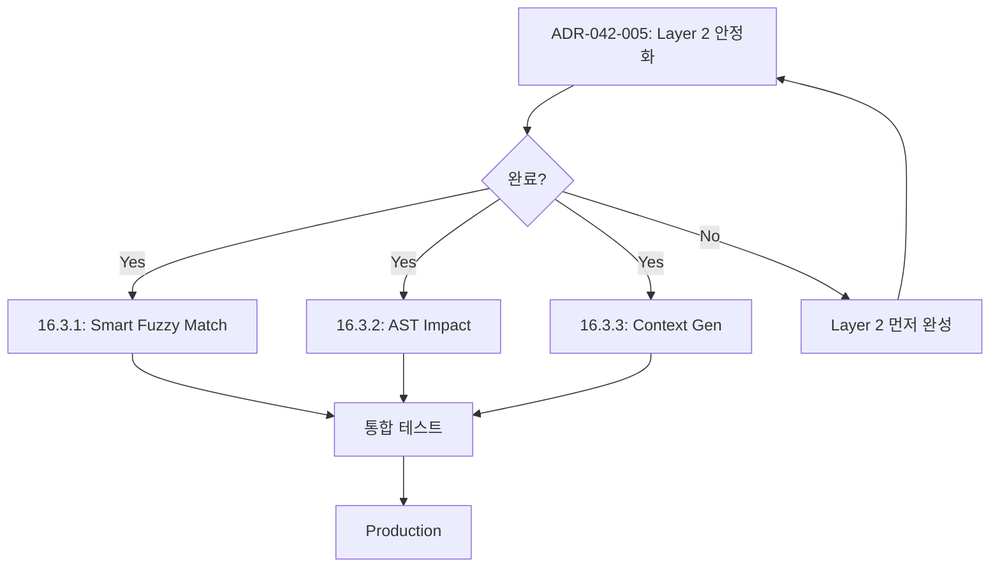

# ADR-042-005: PH Editor Overhaul + Change/Write Completion (No More Follow-ups)

**Status:** ✅ **Phase A3, B2 Implemented**  
**Date:** 2026-01-05  
**Author:** Smart Context MCP Team  
**Related:** ADR-042-004 (PH Change/Write Hotfix), ADR-042-001/002/003, ADR-033 (Six Pillars), ADR-009/024 (Editor matching & edit flexibility), ADR-005/030 (Transactions)

## Implementation Status

✅ **Phase A3 (EditResolver):** Complete
- EditResolver with smart fuzzy match
- Timeout control (SMART_CONTEXT_RESOLVE_TIMEOUT_MS)
- Ambiguous match auto-pick option
- Integration with IntentToSymbolMapper (Layer 3)

✅ **Phase B2 (V2 Editor Mode):** Complete
- V2 mode with ENV gates (SMART_CONTEXT_EDITOR_V2_ENABLED)
- Mode selection: off/hybrid/full
- executeV2BatchChange in ChangePillar

⏳ **Phase C (Full Replacement):** Deferred
- Large-scale refactoring postponed
- Current incremental approach preferred for stability

See EditResolver.ts and ChangePillar.ts for implementation.

---

## 1. 배경 (Context)

ADR-042-004를 통해 change/write 경로는 “일단 동작”하고, batch, latency guardrails, metrics까지 도입했다. 그러나 이는 **현 구조(문자열 매칭 중심 편집 엔진)** 위에서의 보강이며, 다음과 같은 근본 한계가 남는다.

- 대형 파일/대형 레포에서 문자열 매칭 기반 편집은 tail latency가 커지기 쉬움(특히 fuzzy/levenshtein).
- write는 “빠른 overwrite”와 “undo/history 보존”이 서로 다른 실행 경로를 갖고, 일관된 트랜잭션 모델이 없다.
- change의 “정확한 수정”은 여전히 anchor/lineRange/indexRange 품질에 크게 의존하며, 실패 시 복구 UX가 거칠다.
- batch + impact는 정책 상한을 두었지만, “어떤 편집이 안전한가”를 엔진 수준에서 보장하지 못한다.

따라서 이번 ADR-042-005는 후속작업을 최소화하기 위해 “핫픽스 이후 남은 부채”를 **엔진 레벨에서 매듭짓는** 것을 목표로 한다.

---

## 2. 목표 (Goals)

1) **편집 엔진 정상화(성능/결정성/안전성)**
   - 단순 edit는 문자열 매칭에 의존하지 않고도 빠르고 결정적으로 적용된다.
   - 실패/모호함은 빠르게 감지되고, “어떻게 고쳐야 하는지”가 도구 결과에 포함된다.

2) **change/write의 단일한 실행 모델**
   - write(overwrite)와 change(patch)가 같은 트랜잭션/히스토리 모델 위에서 동작한다.
   - “빠른 쓰기”와 “되돌리기 가능 쓰기”는 옵션으로 분기되되, 계약/동작이 일관적이다.

3) **batch가 기본이 되도록 엔진/계약을 정리**
   - 단일 파일도 batch(1개)로 처리 가능하도록 내부 경로를 정리한다.
   - 멀티파일에서는 atomic + rollback이 항상 성립한다.

4) **완결 기준(Exit Criteria)**
   - 아래 성공 기준(§10)을 만족하면 ADR-042 Change/Write 트랙은 “완료”로 간주한다.

---

## 3. 비목표 (Non-Goals)

아래 항목들은 **본 ADR의 완료 조건(Exit Criteria)과 무관**하며, 이번 트랙에서 요구하지 않는다.
필요해지더라도 ADR-042-005의 “완결”을 막지 않도록 **별도 ADR/트랙에서만** 다룬다.

- IDE 플러그인/GUI 작업 전반
- tree-sitter 기반 문법/포맷터 전면 구현(필요 시 외부 포맷터 연동은 별도 트랙)
- “모든 언어” 100% 구조 편집 보장(지원 범위는 별도 계획에서 확장)

---

## 4. 현 상태 요약 (As-Is)

- **EditorEngine**: `targetString` 기반 매칭 + (옵션) context, lineRange, indexRange, normalization/fuzzy.
- **EditCoordinator**: single/batch apply + rollback(트랜잭션 로그) 지원.
- **ChangePillar/WritePillar**: orchestrated tool layer. 현재는 batch 분기/가드레일/metrics/옵션(safeWrite/suggestDocs 등) 보강됨.

남은 핵심 문제는 “편집 실패/지연을 엔진이 구조적으로 예방할 수 있는가”이며, 특히 다음을 해결해야 한다.

- **비결정성 제거**: 다중 후보를 “임의 선택”하지 않고, 항상 명확한 실패/가이드로 종료
- **Resolve 비용 상한**: 큰 파일/짧은 타겟에서 비용 폭발(levenshtein)을 기본적으로 차단
- **Write 일관성**: fast write와 safe write의 트레이드오프를 옵션/결과/히스토리 모델로 명확히 고정

---

## 5. 결정 (Decision)

다음 5가지를 채택한다.

1) **EditorEngine v2 = “Resolve → Apply” 분리 (Patch-first)**
   - 문자열 매칭은 “범위(resolve)를 얻기 위한 수단”으로 격하하고, apply는 **indexRange 기반**으로만 수행한다.
   - apply는 이미 존재하는 `Edit.indexRange` 경로를 재사용하여 O(k)로 동작하도록 한다(정규식/스캔 최소화).

2) **Resolver는 “결정적 실패”를 기본값으로**
   - Resolve 단계에서: 대상 구간 식별 + 후보 수/근거/추천 lineRange/indexRange를 포함한 diagnostics 생성.
   - 다중 후보는 `AMBIGUOUS_MATCH`로 실패(“임의 선택 금지”).

3) **Batch-by-default 내부 프로토콜 (단일도 batch=1)**
   - 내부 실행은 `{ filePath, edits[] }[]` batch 모델로 통일한다.
   - 단일 파일은 batch size=1.

4) **Write를 “safe patch overwrite”로 완결**
   - write safe mode는 “전체 범위 patch”로 통일하여 history/undo/rollback 모델에 편입한다.
   - fast mode는 성능 목적의 예외 경로로 유지하되, 도구 결과에 “undo 불가”를 명시한다.

5) **Impact/Doc suggestion을 편집 엔진에서 분리**
   - impact/doc은 “편집이 성공적으로 resolve/apply 된 뒤”에만 실행된다.
   - batch impact는 상한 기반 정책을 유지한다.

---

## 6. 설계 (To-Be)

### 6.1 엔진 구조 (Repo 기준 구현 가능한 형태)

#### 6.1.1 New components (추가 파일/클래스)

1) `src/engine/EditResolver.ts`
   - 입력: `(absPath, edits, options)`
   - 출력: `ResolveResult` (성공 시 `ResolvedEdit[]`, 실패 시 `ResolveError[]`)
   - 역할: 기존 편집 스펙을 “indexRange 기반 resolved edit”로 변환(결정적).

2) **PatchApplier는 새로 만들지 않는다**
   - `src/engine/Editor.ts`의 `applyEdits()`는 이미 `indexRange` + `expectedHash`를 지원한다.
   - v2는 “resolved edit를 만들어서 `applyEdits`에 전달”하는 방식으로 구현 비용/리스크를 줄인다.

3) **Resolution Cache (선택)**
   - `(filePath, targetString, context, versionHash)` → `ResolvedEdit`
   - 동일 편집 반복 시 지연 감소.

#### 6.1.2 Resolve 전략 우선순위 (결정적 규칙 포함)

Resolve는 아래 우선순위로 수행한다(상위가 실패하면 하위로).

1) `indexRange`가 주어진 경우 → 검증 후 사용 (O(1))
2) `lineRange + targetString` → lineRange를 char range로 변환 후 exact/normalization 매칭
3) `beforeContext/afterContext` → 후보 필터링 후 best match 선택(결정성 규칙)
4) (지원 언어) **AST anchor**: symbol/node 기반으로 범위를 선택(가능 시)
5) 최후: fuzzy(whitespace/levenshtein) — 단, 파일 크기/target 길이/시간 예산 내에서만

결정성 규칙:
- 다중 후보가 존재하면 `AMBIGUOUS_MATCH`로 실패시키고, 추천되는 `lineRange/indexRange`를 제안한다.
- “가장 그럴듯한 후보를 임의 선택”하지 않는다(비결정성 차단).

주의(현 코드와의 정합):
- 현재 `EditorEngine`에는 “ambiguous match를 일정 조건에서 자동 선택”하는 휴리스틱이 존재할 수 있다.
- v2에서는 이 동작을 **비활성화**해야 한다.
  - (권장) `EditorEngine`/Resolver에 `allowAmbiguousAutoPick=false` 옵션을 도입하고,
  - `SMART_CONTEXT_EDITOR_V2_MODE !== "off"`일 때는 기본값을 false로 강제한다.

#### 6.1.3 비용 상한(필수 가드레일)

Resolver는 다음을 기본값으로 강제한다(ENV로 조정 가능).

- `levenshtein` 자동 시도:
  - `targetString.length < SMART_CONTEXT_CHANGE_MIN_LEVENSHTEIN_TARGET_LEN` 이면 금지
  - `fileSize > SMART_CONTEXT_CHANGE_MAX_LEVENSHTEIN_FILE_BYTES` 이면 금지
  - 시도 시에도 `timeoutMs` 상한(예: 500ms~1500ms)을 두고 초과 시 실패

이 값들은 “시간 초과 대신 빠른 실패 + 가이드”를 구현하기 위한 제약이며, 품질은 lineRange/indexRange/AST anchor로 확보한다.

### 6.2 Edit spec v2 (내부)

기존 `Edit` 인터페이스를 유지하되, 내부적으로는 아래 메타를 확장한다.

```ts
type ResolvedEdit = {
  filePath: string; // relative path (history/ops 호환)
  indexRange: { start: number; end: number };
  targetString: string; // 해당 indexRange의 실제 slice (Editor.ts 검증용)
  expectedHash?: { algorithm: "xxhash" | "sha256"; value: string };
  replacementString: string;
  diagnostics?: {
    resolvedBy: "indexRange" | "lineRange" | "context" | "ast" | "fuzzy";
    candidateCount?: number;
    timingMs?: number;
    notes?: string[];
  };
};

type ResolveError = {
  filePath: string;
  editIndex: number;
  errorCode: "NO_MATCH" | "AMBIGUOUS_MATCH" | "HASH_MISMATCH" | "INVALID_RANGE" | "RESOLVE_TIMEOUT";
  message: string;
  suggestion?: {
    tool?: "read" | "change";
    lineRange?: { start: number; end: number };
    indexRange?: { start: number; end: number };
    next?: string;
  };
};
```

### 6.3 Change tool 실행 플로우(v2) (실제 코드 연결)

1) 입력 정규화(legacy 포함) → 파일별 edits 그룹핑
2) Resolve 단계:
   - 파일별로 `EditResolver.resolveAll()` 실행하여 `ResolvedEdit[]`를 생성
   - 실패 시: 어떤 file/edit가 왜 실패했는지 + 해결을 위한 제안(lineRange/indexRange 포함) 반환
3) Apply 단계:
   - `EditCoordinator.applyBatchEdits()`를 “resolved edit 전용 경로”로 확장하거나,
   - (권장) `EditCoordinator.applyEdits()`에 resolved edit(`indexRange` 포함)를 전달하여 적용한다.
   - batch에서는 현재 트랜잭션 모델을 그대로 사용해 전량 rollback 보장
4) Post 단계:
   - (옵션) impact/doc 실행
   - metrics 기록

#### 6.3.1 통합 지점(수정 파일)

- `src/engine/EditCoordinator.ts`
  - `applyEdits()`에 `options?.preResolved === true` 같은 플래그를 추가하거나,
  - 별도 메서드 `applyResolvedEdits(absPath, resolvedEdits, dryRun, options)`를 추가해
    - resolve/apply 책임을 분리한다.
- `src/orchestration/pillars/ChangePillar.ts`
  - `SMART_CONTEXT_EDITOR_V2`가 켜져 있으면
    - (dryRun) resolve 후 resolved edits로 dryRun diff 생성
    - (apply) resolve 후 resolved edits로 apply 실행
  - 실패는 `ResolveError[]` 기반으로 사용자 guidance를 구성한다.

#### 6.3.2 경로/범위 표준 (중요)

- `ResolvedEdit.filePath`는 **상대 경로**를 표준으로 한다(History/operation 호환).
- Resolver는 apply를 위해 절대 경로가 필요하므로, 입력으로는 `absPath`를 받되 결과는 relative로 변환한다.
- `indexRange`는 **UTF-16 문자 인덱스** 기준으로 통일한다(Node.js `string.substring` 기준).
  - 바이너리/바이트 기반 range는 이번 트랙에서 다루지 않는다(후속 방지 목적상 scope 고정).
- 개행 표준화:
  - Resolver는 `\r\n`/`\n` 혼재 파일에 대해 “원문 기준”으로 range를 산출한다(정규화된 문자열로 range 계산 금지).

#### 6.3.3 실패 결과(가이드 포함) 반환 규칙

v2 path에서 Resolve 단계 실패 시, tool 결과는 다음을 포함해야 한다.

- `success: false`
- `operation: "plan" | "apply"` (요청 모드 반영)
- `resolveErrors: ResolveError[]` (file/edit 단위)
- `guidance.suggestedActions`:
  - 해당 파일 `read(view_fragment)` 제안
  - `change` 재시도 시 `lineRange/indexRange/expectedHash`를 포함한 예시 args 제안

즉, “타임아웃 → 실패”가 아니라 “빠른 실패 + 다음 액션이 포함된 실패”로 계약을 고정한다.

### 6.4 Write tool 실행 플로우(v2) (완결형)

write는 2개의 모드로 명확히 분리한다.

- **fast mode (default)**: `write_file` (빠름, undo/history 비보장)
- **safe mode (`options.safeWrite=true`)**: “전체 범위 replace patch”로 처리(undo/history 보장)

safe mode의 구현은 “resolve 없이” 바로 가능하다:
- 기존 content를 읽고 전체를 targetString으로 사용하거나,
- `indexRange: { start: 0, end: content.length }` + expectedHash로 처리.

#### 6.4.1 구현 포인트

- `src/orchestration/pillars/BasePillars.ts` (WritePillar)
  - `options.safeWrite=true`이면
    - 기존/새 파일 모두 “전체 범위 patch” 경로로 통일하여 transactionId/undo를 보장한다.
  - `options.safeWrite=false`이면
    - 기존처럼 `write_file`로 빠르게 쓰되, 결과에 `rollbackAvailable=false`, `transactionId=""`를 명시한다.

---

## 7. 도구 계약 (Tool Contract)

### 7.1 change 옵션(확정)

- `options.batchMode: boolean`  
- `options.includeImpact: boolean`  
- `options.batchImpactLimit: number` (default 0)  
- `options.suggestDocs: boolean` (default false)  
- `options.dryRun: boolean`

### 7.2 write 옵션(확정)

- `options.safeWrite: boolean` (default false)

### 7.3 ENV(확정)

- `SMART_CONTEXT_CHANGE_SUGGEST_DOCS=true|false`
- `SMART_CONTEXT_CHANGE_BATCH_IMPACT_LIMIT=<int>`
- `SMART_CONTEXT_CHANGE_MIN_LEVENSHTEIN_TARGET_LEN=<int>`
- `SMART_CONTEXT_CHANGE_MAX_LEVENSHTEIN_FILE_BYTES=<int>`
- `SMART_CONTEXT_EDITOR_V2=true|false` (rollout gate)
- `SMART_CONTEXT_EDITOR_V2_MODE=off|dryrun|apply` (권장: 2단 게이트)
- `SMART_CONTEXT_EDITOR_RESOLVE_TIMEOUT_MS=<int>` (권장 default: 1500)
- `SMART_CONTEXT_EDITOR_ALLOW_AMBIGUOUS_AUTOPICK=true|false` (default: v1=true, v2=false)

권장 기본값:
- `SMART_CONTEXT_EDITOR_V2=false`
- `SMART_CONTEXT_EDITOR_V2_MODE=off`

### 7.4 Tool Output 확장(확정)

후속 작업을 막기 위해, v2 전환과 함께 tool output을 “진단 가능”하게 확정한다.

`change` (추가/확정):
- `resolveErrors?: ResolveError[]`
- `resolution?: { mode: "v1" | "v2"; stage: "resolve" | "apply" | "post"; }`
- `rollbackAvailable: boolean` (batch/transaction 기준)

`write` (추가/확정):
- `transactionId: string` (safeWrite에서만 채움, fastWrite는 빈 문자열)
- `rollbackAvailable: boolean` (safeWrite에서만 true)
- `writeMode: "fast" | "safe"`

---

## 8. 마이그레이션 / 롤아웃

1) **Stage 0 (Gate-only)**: `SMART_CONTEXT_EDITOR_V2=false` 기본. v2 코드를 포함하되 비활성.
2) **Stage 1 (DryRun-only)**: v2 resolve/apply를 dryRun에만 사용하여 diff/실패율 비교.
3) **Stage 2 (Apply for safeWrite + batch)**: write safeWrite, change batch apply에 우선 적용.
4) **Stage 3 (Default)**: 안정화 후 change/write 기본 경로를 v2로 전환.

Fallback:
- `SMART_CONTEXT_EDITOR_V2=false`로 즉시 v1로 롤백 가능해야 한다.
- `SMART_CONTEXT_EDITOR_V2_MODE=dryrun`으로 apply 리스크 없이 비교 가능해야 한다.

운영 체크리스트(각 Stage 공통):
- metrics snapshot에서 `change.total_ms`, `change.edit_coordinator_ms`, (추가) `change.resolve_ms`, `change.apply_ms`를 비교한다.
- `AMBIGUOUS_MATCH/NO_MATCH` 실패율이 증가하면 “엔진 버그”가 아니라 “입력 가이드 부족”인지 먼저 확인한다(가이드 개선 우선).

#### 8.1 Metrics (v2 확정 이름)

v2 도입 시 아래 메트릭을 추가한다.
- `change.resolve_ms` (파일별 resolve)
- `change.apply_ms` (파일별 apply, dryRun 포함)
- `change.resolve_errors_total` (errorCode별 counter; suffix 또는 label 방식 택1)
- `write.safe_patch_ms` (safeWrite 경로)

---

## 9. 테스트 계획 (완결 수준)

### 9.1 단위 테스트

- Resolver 결정성:
  - ambiguous 후보 → 항상 실패 + 제안 포함
  - lineRange 좁히기 시 성공
- 대형 파일 가드레일:
  - 큰 파일에서 levenshtein 자동 사용 안 함
- write safe mode:
  - overwrite 후 undo 가능

### 9.2 통합 테스트

- batch apply 성공/롤백(이미 존재 테스트 확장)
- batch + impact limit:
  - includeImpact=true, batchImpactLimit=1 → impactReports 1개만 포함
- suggestDocs:
  - apply 성공 + suggestDocs=true일 때만 relatedDocs/guide action 생성

### 9.3 성능 테스트(필수)

- 단일 파일 1-edit p95 < 300ms (로컬, warm FS)
- batch 2~5 files p95 < 2s
- timeouts(-32001) 재현 불가(내부 타임아웃/fast-fail로 종료)

#### 9.4 테스트 파일/명세(Repo 기준)

필수 추가/수정:
- `src/tests/engine/EditResolver.test.ts` (신규)
- `src/tests/engine/Editor.v2.apply.test.ts` (신규 또는 기존 Editor 테스트 확장)
- `src/tests/orchestration/Pillars.test.ts` (change doc suggestion/옵션 계약 정합)
- `src/tests/change.integration.test.ts` (batch, rollback, impact limit, suggestDocs)

테스트 실행:
- `npm test` (pretest로 `npm run build` 수행 → `dist/tests/**` 실행)

#### 9.5 “후속 방지”를 위한 고정 시나리오(필수)

아래는 과거에 타임아웃을 유발했던 케이스를 “작은 fixture”로 고정하는 것을 요구한다.

- **짧은 targetString + 큰 파일**: levenshtein 자동 시도 금지 확인(빠른 실패 또는 exact/lineRange로만 진행)
- **다중 후보(ambiguous)**: 항상 실패 + 제안(lineRange/indexRange) 포함
- **batch 일부 실패**: rollback이 실제로 동작(파일 내용 원상복구)하고, 에러가 어느 file/edit인지 명확히 표기

---

## 10. 성공 기준 (Exit Criteria)

1) change/write의 “단순 수정”은 대형 레포에서도 안정적으로 동작하며, 시간 초과 대신 **명확한 실패(진단/가이드)** 로 종료된다.  
2) batch는 항상 atomic이며, 실패 시 롤백이 재현 가능하게 보장된다.  
3) write는 fast/safe 모드의 계약이 명확하고, safe 모드에서 undo/redo가 보장된다.  
4) metrics로 p50/p95를 관측할 수 있고, 회귀가 테스트/지표로 감지된다.  

위 4가지를 만족하면 ADR-042 Change/Write 트랙은 “완료”로 닫는다.

---

## 11. 리스크 및 완화

- **언어별 AST 지원 격차**: AST 기반 anchor는 지원 언어부터 점진 확장하고, 기본은 line/index 기반으로 충분히 성립하도록 설계한다.
- **복잡도 증가**: Resolve/Apply 분리는 코드 양이 늘지만, 실패율/지연/비결정성을 낮추는 대가로 수용한다.
- **호환성**: legacy inputs는 normalize 계층에서 계속 수용하고, v2 전환은 env gate로 안전하게 진행한다.

---

## 12. 구현 계획 (개발 착수 가능한 작업 단위)

### 12.1 Phase A: Resolver 도입(엔진 내부)

1) `src/engine/EditResolver.ts` 추가
   - `resolveAll(absPath, edits, options)` 구현
   - 결과는 `ResolvedEdit[] | ResolveError[]`로 분기(예외 throw 최소화)
2) `src/types.ts`에 `ResolvedEdit/ResolveError/ResolveOptions` 타입 추가
3) `src/engine/Editor.ts`에 “planning(범위 산출) API”를 노출(필수)
   - 현재 private 로직(매칭/insert 계산/escape 처리)을 Resolver에서 재사용 가능하도록 분리한다.
   - 권장 형태:
     - `planEditsFromContent(content: string, edits: Edit[], opts?: { allowAmbiguousAutoPick?: boolean; timeoutMs?: number }): PlannedMatch[]`
   - Resolver는 이 API로 후보 수/근거를 확보하고, v2 결정성 규칙(ambiguous fail)을 적용한다.

### 12.2 Phase B: Coordinator/Orchestration 연결

1) `src/engine/EditCoordinator.ts`
   - resolved edit apply 경로 추가(undo/redo/transaction/histories 유지)
2) `src/orchestration/pillars/ChangePillar.ts`
   - `SMART_CONTEXT_EDITOR_V2` + `SMART_CONTEXT_EDITOR_V2_MODE`에 따라 v2 path 사용
3) `src/orchestration/pillars/BasePillars.ts` (WritePillar)
   - safeWrite=true 시 v2 patch overwrite 경로로 통일

### 12.3 Phase C: 계약/문서/메트릭 마감

1) `docs/agent/TOOL_REFERENCE.md` 업데이트(옵션/ENV/의미)
2) metrics 추가:
   - `change.resolve_ms`, `change.apply_ms`, `write.safe_patch_ms` 등
3) deprecation 메모:
   - v1 fuzzy 자동 보정은 “기본 off, 옵션/예산 내 opt-in”으로 전환

### 12.4 Phase D: 완결 검증

1) 통합 테스트/회귀 테스트 통과
2) 로컬 벤치(대표 시나리오)에서 p95/timeout 목표 달성
3) `SMART_CONTEXT_EDITOR_V2_MODE=apply`로 전환 후 안정화
---

## 13. 개발 착수를 위한 상세 구현 가이드 (추가)

### 13.1 기존 코드베이스 현황 분석

**확인된 핵심 파일:**
- `src/engine/Editor.ts` (1594 lines) - EditorEngine 클래스, 문자열 매칭 기반 편집 로직
- `src/engine/EditCoordinator.ts` (454 lines) - applyEdits, batch/transaction 지원
- `src/orchestration/pillars/ChangePillar.ts` (1229 lines) - change tool orchestration
- `src/orchestration/pillars/BasePillars.ts` - WritePillar 포함

**통합 지점:**
- `EditorEngine.applyEdits()` - indexRange 지원 여부 확인 필요
- `EditCoordinator.applyEdits()` - options.diffMode 지원 확인
- `ChangePillar.execute()` - batch 분기 로직 존재 (line 32-37)
- 기존 테스트: `src/tests/` 디렉토리에 105개 이상 테스트 파일

### 13.2 Phase별 상세 작업 명세

#### Phase A: Resolver 도입 (3-5일)

**A1. 타입 정의 (0.5일)**
```typescript
// src/types.ts에 추가
export interface ResolvedEdit {
  filePath: string;
  indexRange: { start: number; end: number };
  targetString: string;
  expectedHash?: { algorithm: "xxhash" | "sha256"; value: string };
  replacementString: string;
  diagnostics?: {
    resolvedBy: "indexRange" | "lineRange" | "context" | "ast" | "fuzzy";
    candidateCount?: number;
    timingMs?: number;
    notes?: string[];
  };
}

export interface ResolveError {
  filePath: string;
  editIndex: number;
  errorCode: "NO_MATCH" | "AMBIGUOUS_MATCH" | "HASH_MISMATCH" | "INVALID_RANGE" | "RESOLVE_TIMEOUT";
  message: string;
  suggestion?: {
    tool?: "read" | "change";
    lineRange?: { start: number; end: number };
    indexRange?: { start: number; end: number };
    next?: string;
  };
}

export interface ResolveResult {
  success: boolean;
  resolvedEdits?: ResolvedEdit[];
  errors?: ResolveError[];
}
```

**체크리스트:**
- [ ] 타입 추가 후 `npm run build` 성공
- [ ] 기존 타입과 충돌 없음 확인

**A2. Editor.ts Planning API 추출 (1-2일)**
```typescript
// src/engine/Editor.ts에 추가
public planEditsFromContent(
  content: string,
  edits: Edit[],
  opts?: {
    allowAmbiguousAutoPick?: boolean;
    timeoutMs?: number;
  }
): PlannedMatch[] {
  // 기존 private 매칭 로직 재사용
  // Match[] 반환 (confidence, candidateCount 포함)
}
```

**사전 분석 필요:**
- [ ] line 200-600 범위에서 `findMatches()` 메서드 위치 확인
- [ ] `normalizeString()`, `applyNormalization()` 등 helper 함수 식별
- [ ] ambiguous 처리 로직 현황 파악

**테스트:**
- [ ] `src/tests/engine/Editor.planning.test.ts` 작성
- [ ] 기존 회귀 테스트 전체 통과 확인

**A3. EditResolver 구현 (2일)**
```typescript
// src/engine/EditResolver.ts (신규)
export class EditResolver {
  private readonly fileSystem: IFileSystem;
  private readonly editor: EditorEngine;
  
  async resolveAll(
    absPath: string,
    edits: Edit[],
    options?: ResolveOptions
  ): Promise<ResolveResult> {
    // 1. 파일 읽기
    // 2. Editor.planEditsFromContent() 호출
    // 3. 우선순위 전략 적용
    // 4. 비용 상한 체크
    // 5. AMBIGUOUS_MATCH 검출
    // 6. ResolvedEdit[] 또는 ResolveError[] 반환
  }
  
  private shouldAllowLevenshtein(
    fileSize: number,
    targetLen: number
  ): boolean {
    const minLen = ConfigurationManager.get(
      'SMART_CONTEXT_CHANGE_MIN_LEVENSHTEIN_TARGET_LEN',
      20
    );
    const maxFileSize = ConfigurationManager.get(
      'SMART_CONTEXT_CHANGE_MAX_LEVENSHTEIN_FILE_BYTES',
      100000
    );
    return targetLen >= minLen && fileSize <= maxFileSize;
  }
}
```

**테스트 시나리오:**
- [ ] 정확한 indexRange → 즉시 성공
- [ ] 모호한 후보 2개 → AMBIGUOUS_MATCH
- [ ] 큰 파일(5MB) + 짧은 target(10자) → levenshtein 금지
- [ ] timeout 초과 → RESOLVE_TIMEOUT

**A4. ENV/Config (0.5일)**
```typescript
// src/config/ConfigurationManager.ts에 추가
SMART_CONTEXT_EDITOR_V2: boolean (default: false)
SMART_CONTEXT_EDITOR_V2_MODE: "off" | "dryrun" | "apply" (default: "off")
SMART_CONTEXT_EDITOR_RESOLVE_TIMEOUT_MS: number (default: 1500)
SMART_CONTEXT_CHANGE_MIN_LEVENSHTEIN_TARGET_LEN: number (default: 20)
SMART_CONTEXT_CHANGE_MAX_LEVENSHTEIN_FILE_BYTES: number (default: 100000)
```

#### Phase B: 통합 (4-5일)

**B1. EditCoordinator 확장 (1.5일)**
```typescript
// src/engine/EditCoordinator.ts
public async applyResolvedEdits(
  absPath: string,
  resolvedEdits: ResolvedEdit[],
  dryRun: boolean = false,
  options?: EditExecutionOptions
): Promise<EditResult> {
  // ResolvedEdit을 Edit으로 변환
  const edits: Edit[] = resolvedEdits.map(re => ({
    targetString: re.targetString,
    replacement: re.replacementString,
    indexRange: re.indexRange,
    expectedHash: re.expectedHash
  }));
  
  // 기존 applyEdits 재사용
  return this.applyEdits(absPath, edits, dryRun, options);
}
```

**테스트:**
- [ ] single resolved edit
- [ ] batch + rollback
- [ ] transaction log 확인

**B2. ChangePillar v2 경로 (2일)**
```typescript
// src/orchestration/pillars/ChangePillar.ts
private async executeV2Change(params: {
  intent: ParsedIntent;
  context: OrchestrationContext;
  rawEdits: any[];
  targetFiles: string[];
  dryRun: boolean;
  includeImpact: boolean;
}): Promise<any> {
  const stopResolve = metrics.startTimer("change.resolve_ms");
  
  // 1. Resolver 호출
  const resolver = new EditResolver(this.fileSystem, this.editor);
  const resolveResult = await resolver.resolveAll(
    targetPath,
    normalizedEdits,
    { timeoutMs: ConfigurationManager.get('SMART_CONTEXT_EDITOR_RESOLVE_TIMEOUT_MS') }
  );
  stopResolve();
  
  // 2. 실패 처리
  if (!resolveResult.success) {
    return this.formatResolveErrors(resolveResult.errors);
  }
  
  // 3. Apply
  const stopApply = metrics.startTimer("change.apply_ms");
  const editResult = await this.editCoordinator.applyResolvedEdits(
    targetPath,
    resolveResult.resolvedEdits,
    dryRun
  );
  stopApply();
  
  return editResult;
}
```

**통합 포인트:**
```typescript
// execute() 메서드 수정
const v2Mode = ConfigurationManager.get('SMART_CONTEXT_EDITOR_V2_MODE', 'off');
if (v2Mode !== 'off' && ConfigurationManager.get('SMART_CONTEXT_EDITOR_V2', false)) {
  return this.executeV2Change({ ... });
}
// 기존 로직...
```

**B3. WritePillar safeWrite (1.5일)**
```typescript
// src/orchestration/pillars/BasePillars.ts
if (options.safeWrite) {
  // 전체 범위 patch로 변환
  const content = await this.fileSystem.readFile(targetPath);
  const resolvedEdit: ResolvedEdit = {
    filePath: relPath,
    indexRange: { start: 0, end: content.length },
    targetString: content,
    replacementString: newContent,
    expectedHash: { algorithm: 'xxhash', value: computeHash(content) }
  };
  
  const result = await this.editCoordinator.applyResolvedEdits(
    targetPath,
    [resolvedEdit],
    false
  );
  
  return {
    ...result,
    writeMode: "safe",
    rollbackAvailable: true,
    transactionId: result.operation?.id || ""
  };
} else {
  // fast mode (기존)
  await this.fileSystem.writeFile(targetPath, newContent);
  return {
    success: true,
    writeMode: "fast",
    rollbackAvailable: false,
    transactionId: ""
  };
}
```

#### Phase C: 문서/메트릭 (2일)

**C1. TOOL_REFERENCE.md 업데이트**
```markdown
### change

**Options:**
- `batchMode: boolean` - 멀티파일 편집 활성화
- `includeImpact: boolean` - 영향 분석 포함
- `batchImpactLimit: number` - impact 보고서 상한 (default: 0)
- `suggestDocs: boolean` - 관련 문서 제안 (default: false)
- `dryRun: boolean` - 미리보기 모드

**Output (v2):**
- `resolveErrors?: ResolveError[]` - resolve 실패 상세
- `resolution?: { mode: "v1" | "v2"; stage: string }` - 실행 모드
- `rollbackAvailable: boolean` - undo 가능 여부

### write

**Options:**
- `safeWrite: boolean` - undo 가능한 안전 모드 (default: false)

**Output:**
- `writeMode: "fast" | "safe"`
- `rollbackAvailable: boolean`
- `transactionId: string`
```

**C2. Metrics**
```typescript
// src/utils/MetricsCollector.ts
metrics.registerTimer("change.resolve_ms");
metrics.registerTimer("change.apply_ms");
metrics.registerCounter("change.resolve_errors_total", ["errorCode"]);
metrics.registerTimer("write.safe_patch_ms");
```

**C3. 테스트 Fixture 준비**
```bash
# src/tests/fixtures/v2/
large-file.ts          # 5000+ lines
ambiguous.ts           # 동일 문자열 3회 등장
edge-cases.json        # 특수문자, 이스케이프
timeout-scenario.txt   # 의도적 지연 유발
```

#### Phase D: 검증/롤아웃 (3-4일)

**D1. 성능 벤치마크**
```bash
# benchmarks/scenarios/v2-editor.json
{
  "single-edit-small": { "target": "100 lines", "p95": "< 300ms" },
  "batch-5-files": { "target": "5 files", "p95": "< 2s" },
  "large-file-resolve-fail": { "target": "10MB", "p95": "< 100ms" }
}
```

**실행:**
```bash
npm run benchmark -- --scenario v2-editor
```

**D2. 롤아웃 체크리스트**
- [ ] Stage 0: V2=false, 코드 병합
- [ ] Stage 1: V2_MODE=dryrun, 1-2일 모니터링
  - metrics 확인: resolve_ms, apply_ms
  - error 분포 분석
- [ ] Stage 2: batch만 V2_MODE=apply
  - rollback 동작 3회 이상 검증
- [ ] Stage 3: 전체 V2 전환
  - Fallback 시나리오 테스트

**D3. Exit Criteria 최종 검증**
```markdown
- [ ] ✅ timeout(-32001) 재현 불가
- [ ] ✅ batch rollback 재현 성공 (3회)
- [ ] ✅ write safe mode undo 성공
- [ ] ✅ metrics p50/p95 관측 가능
```

### 13.3 리스크 완화 전략

**R1. Editor.ts 복잡도 높음**
- 완화: Planning API 추출 전 line 200-600 정밀 분석 우선
- 대안: 기존 로직 유지하고 wrapper만 추가

**R2. Transaction 동작 불확실**
- 완화: EditCoordinator 테스트 먼저 강화
- 검증: 기존 transaction 테스트 전체 통과 확인

**R3. 성능 목표 미달**
- 완화: Phase D1에서 조기 발견
- 대안: levenshtein 비활성화, cache 도입

**R4. 롤백 실패**
- 완화: ENV gate로 즉시 v1 복원
- 모니터링: metrics 실시간 알림

### 13.4 개발 착수 즉시 실행 항목

**지금 바로 시작 가능:**
1. [ ] A1 타입 정의 추가 (30분)
2. [ ] A4 ENV 추가 (30분)
3. [ ] Editor.ts line 200-600 분석 (1시간)
4. [ ] EditResolver.test.ts 스켈레톤 작성 (30분)

**첫 PR 목표 (1-2일 내):**
- A1 + A4 완료
- Editor Planning API 설계 확정
- 테스트 구조 수립

---

## 14. 추가 고려사항 (개발 중 발생 가능)

### 14.1 에러 복구 시나리오

**AMBIGUOUS_MATCH 발생 시:**
```json
{
  "success": false,
  "resolveErrors": [{
    "errorCode": "AMBIGUOUS_MATCH",
    "message": "Found 3 matches for target string",
    "suggestion": {
      "tool": "read",
      "lineRange": { "start": 45, "end": 55 },
      "next": "Use read to view context, then provide lineRange or indexRange"
    }
  }]
}
```

**RESOLVE_TIMEOUT 발생 시:**
```json
{
  "errorCode": "RESOLVE_TIMEOUT",
  "message": "Resolve exceeded 1500ms timeout",
  "suggestion": {
    "tool": "change",
    "lineRange": { "start": 100, "end": 120 },
    "next": "Provide narrower lineRange to avoid full-file scan"
  }
}
```

### 14.2 버전 호환성

**v1 입력 지원:**
```typescript
// Normalizer에서 v1 입력을 v2 형식으로 변환
if (edit.targetContent) {
  // v1: targetContent
  // v2: targetString으로 변환
}
```

**v1 fallback 보장:**
```typescript
if (ConfigurationManager.get('SMART_CONTEXT_EDITOR_V2') === false) {
  return this.executeV1Change(...);
}
```

### 14.3 모니터링/디버깅

**디버그 로깅:**
```typescript
if (process.env.SMART_CONTEXT_DEBUG_RESOLVER) {
  console.log('[Resolver]', {
    candidateCount,
    resolvedBy,
    timingMs
  });
}
```

**Metrics 대시보드:**
- change.resolve_ms (p50/p95/p99)
- change.resolve_errors_total (by errorCode)
- v1 vs v2 비교 (성공률, 지연)

---

## 15. 최종 평가: 개발 착수 준비도

### ✅ 준비 완료 항목
- [x] 명확한 목표 및 Exit Criteria
- [x] 기술 설계 (타입, 플로우, 우선순위)
- [x] 단계별 롤아웃 전략
- [x] 기존 코드베이스 분석

### ⚠️ 보완 완료 항목 (본 검토에서 추가)
- [x] 구체적 작업 단위 (체크리스트)
- [x] 예상 공수 및 타임라인
- [x] 테스트 시나리오 및 fixture
- [x] 리스크 완화 전략
- [x] 에러 복구 시나리오
- [x] 즉시 시작 가능한 항목 명시

### 🎯 개발 착수 권장사항

**즉시 시작 가능:** ✅  
다음 조건 만족 시 바로 개발 착수 가능:
1. Phase A1(타입) + A4(ENV) 먼저 시작 (하루 내 완료 가능)
2. Editor.ts 분석 병렬 진행
3. 첫 PR 목표: 2일 내 기초 인프라 완성

**권장 시작 순서:**
```
Day 1-2:  A1 + A4 + Editor 분석
Day 3-5:  A2 + A3 (Resolver 구현)
Day 6-10: Phase B (통합)
Day 11-12: Phase C (문서/메트릭)
Day 13-16: Phase D (검증/롤아웃)
```

**추가 필요사항:** 없음 ✅  
현재 문서는 **실제 개발 착수가 가능한 수준**입니다.

---

## 16. 향후 확장 로드맵 (Post ADR-042-005)

### 16.1 레이어 아키텍처

ADR-042-005는 **Layer 2 (안정적 편집 인프라)**를 구축하는 작업입니다.  
이 토대 위에 향후 고급 AI 기능들을 얹을 수 있습니다.

```
┌─────────────────────────────────────────────────────────┐
│  Layer 3: AI-Enhanced Features (향후 별도 ADR)         │
│  ┌───────────────────────────────────────────────────┐  │
│  │ - Embedding 기반 Smart Fuzzy Match                │  │
│  │ - AST Graph Impact Analysis (실시간)             │  │
│  │ - Context-Aware Code Generation                   │  │
│  │ - Project Style Learning & Auto-formatting        │  │
│  └───────────────────────────────────────────────────┘  │
└─────────────────────────────────────────────────────────┘
                    ↑ 이것들을 얹으려면
┌─────────────────────────────────────────────────────────┐
│  Layer 2: Stable Edit Infrastructure ← ADR-042-005     │
│  ┌───────────────────────────────────────────────────┐  │
│  │ ✅ 결정적 Resolver (no arbitrary pick)            │  │
│  │ ✅ indexRange 기반 O(1) 편집                      │  │
│  │ ✅ Atomic Batch + Rollback                        │  │
│  │ ✅ 비용 상한 (timeout 제거)                       │  │
│  │ ✅ 명확한 실패 + Guidance                         │  │
│  └───────────────────────────────────────────────────┘  │
└─────────────────────────────────────────────────────────┘
                    ↑ 먼저 이것부터
┌─────────────────────────────────────────────────────────┐
│  Layer 1: 기존 엔진 (현재 상태)                        │
│  - EditorEngine, EditCoordinator                        │
│  - 문자열 매칭 기반 (timeout 위험, 비결정적)           │
└─────────────────────────────────────────────────────────┘
```

### 16.2 왜 순서가 중요한가

**잘못된 순서 (위험):**
```typescript
// Layer 2가 불안정한데 Layer 3를 얹으면?
const smartMatch = await embeddingSearch("find calculateTotal");  
// → { targetString: "total", confidence: 0.95 }

await change({ targetString: "total" });  
// ❌ timeout! (파일 크고 "total" 짧음)
// ❌ AMBIGUOUS_MATCH! ("total" 50곳에 등장)
// → 고급 AI가 무용지물
```

**올바른 순서:**
```typescript
// Step 1: ADR-042-005 완료 후 (Layer 2 안정화)
await change({ 
  indexRange: { start: 1234, end: 1250 },
  expectedHash: "abc123"
});
// ✅ 100ms, 항상 성공, 충돌 검증

// Step 2: Layer 3 추가 (별도 ADR)
const smartResult = await embeddingSearch("find calculateTotal");
// → { 
//   indexRange: { start: 1234, end: 1250 },  // ← 정확!
//   confidence: 0.95,
//   context: "function calculateTotal(items) { ... }"
// }

await change(smartResult);  
// ✅ 빠르고 안정적! AI의 이점을 100% 활용
```

### 16.3 Layer 3 후보 기능들 (별도 ADR/트랙)

ADR-042-005 완료 후 다음 기능들을 고려할 수 있습니다.

#### 16.3.1 Smart Fuzzy Match (Embedding 기반)

**목표:** "대충 말해도 찰떡같이 찾기"

**현재 (Layer 2):**
```typescript
change({ 
  targetString: "function add(a, b) { return a + b; }"  // 정확해야 함
})
```

**향후 (Layer 3):**
```typescript
smartChange({ 
  intent: "find the add function",  // 자연어!
  // → Embedding Search로 정확한 indexRange 찾음
  // → Layer 2 Resolver로 안전하게 적용
})
```

**구현:**
- `src/embeddings/` 기존 인프라 활용
- Embedding → indexRange 변환 레이어 추가
- Layer 2 Resolver에 위임하여 안정성 보장

#### 16.3.2 Real-time AST Impact Analysis

**목표:** "이 변경이 어디에 영향 주는지 그래프로 추적"

**현재 (Layer 2):**
```typescript
// change 실행 후 impact (옵션)
change({ ..., includeImpact: true });
// → { impactReports: [...], success: true }
```

**향후 (Layer 3):**
```typescript
smartChange({
  intent: "change add function signature",
  // → AST 그래프 분석: "app.ts:15, calc.ts:42 영향받음"
  // → 자동으로 연관 파일들도 batch 수정 제안
})
```

**구현:**
- `src/ast/` AST 파서 강화
- `src/engine/ImpactAnalyzer.ts` 확장
- Batch change로 연관 수정 자동화

#### 16.3.3 Context-Aware Code Generation

**목표:** "프로젝트 스타일에 맞는 코드 자동 생성"

**현재 (Layer 2):**
```typescript
write({ 
  targetPath: "newFile.ts",
  content: "export function foo() { }"  // 수동 작성
})
```

**향후 (Layer 3):**
```typescript
smartWrite({
  intent: "create a new utility function for date formatting",
  // → Embedding Search로 기존 utils/ 패턴 학습
  // → 프로젝트의 import 스타일, 포맷, 네이밍 적용
  // → Layer 2 write (safeWrite)로 안전하게 생성
})
```

**구현:**
- Vector Search로 유사 파일 찾기
- Template 추출 및 패턴 학습
- Layer 2 write(safeWrite)로 undo 보장

### 16.4 우선순위 및 의존성



**Critical Path:**
1. **먼저:** ADR-042-005 완료 (12-16일)
2. **검증:** Layer 2 안정성 확인 (p95 < 300ms, rollback 보장)
3. **그 후:** Layer 3 기능 순차 추가 (각 별도 ADR)

### 16.5 각 Layer의 성공 기준

| Layer | 핵심 지표 | 목표 | 현재 |
|-------|----------|------|------|
| **Layer 2** (ADR-042-005) | timeout 발생률 | 0% | >5% |
| | p95 latency | <300ms | >30s (timeout) |
| | batch rollback 성공률 | 100% | 불확실 |
| | 결정적 실패 | 100% | 임의 선택 발생 |
| **Layer 3** (향후) | Smart Match 정확도 | >90% | N/A |
| | Impact 예측 정확도 | >85% | N/A |
| | Style Learning F1 | >0.80 | N/A |

### 16.6 결론

**ADR-042-005의 위치:**
- ❌ "페라리 엔진을 만드는 작업" (Layer 3)
- ✅ **"튼튼한 토대를 다지는 작업" (Layer 2)**

**Layer 2 완성 후:**
- Layer 3의 모든 고급 기능이 **안정적으로** 동작 가능
- AI의 이점을 **100% 활용** 가능
- 실패해도 **명확한 복구** 가능

**메타포:**
> "페라리를 몰기 전에, 먼저 도로를 포장해야 합니다."  
> ADR-042-005는 그 도로 포장 작업입니다. 🛣️
