# Agent Playbook: Mastering Smart Context MCP

> **Master the Scout → Read → Edit pipeline to achieve 95% token efficiency and bulletproof reliability.**

This playbook captures battle-tested workflow patterns and recovery strategies for AI agents using Smart Context MCP. Whether you're renaming symbols across 50 files or debugging a production issue, these patterns will guide you to success.

---

## Core Philosophy: Scout → Read → Edit

The Scout → Read → Edit pipeline is the **canonical workflow** enforced by Smart Context MCP architecture. It optimizes for both token efficiency and reliability by ensuring you never read more than necessary.

```mermaid
graph LR
    A["🔍 Scout<br/>(Find targets)"] -->|search_project<br/>100 tokens| B["👁️ Read<br/>(Understand structure)"]
    B -->|read_code view=skeleton<br/>200 tokens| C["✏️ Edit<br/>(Apply changes)"]
    C -->|edit_code<br/>500 tokens| D["✅ Verify<br/>(Confirm correctness)"]
    
    A -->|Fast<br/>O1| E["Cost: ~800 tokens<br/>Reliability: 99%"]
    
    F["❌ Anti-pattern<br/>read_code view=full"] -->|4000 tokens| G["Slow & Expensive<br/>Lost in context"]
    
    style A fill:#90EE90
    style B fill:#87CEEB
    style C fill:#FFB6C1
    style D fill:#DDA0DD
    style E fill:#F0F8FF
    style F fill:#FF6B6B
    style G fill:#FF6B6B
```



### The Three Phases Explained

#### Phase 1: Scout (Discovery)
**Goal:** Locate targets without loading full file contents.

**Tools:**
- `search_project(type="filename")` - Find files by name (fastest)
- `search_project(type="symbol")` - Find function/class definitions
- `analyze_relationship(mode="dependencies")` - Understand file relationships

**Why Scout First:**
- Trigram index filters 400 candidates in O(1) time
- Avoid reading unrelated files entirely
- Narrow your scope before deep exploration

**Cost:** ~100 tokens  
**Latency:** ~50ms

#### Phase 2: Read (Comprehension)
**Goal:** Understand file structure without reading implementation details.

**Tools:**
- `read_code(view="skeleton")` - Get signatures, imports, structure
- `read_code(view="fragment", lineRange="start-end")` - Read specific sections

**Key Rule:** 
> **Never start with `view="full"`**

Skeleton view compresses code by 95-98% using AST folding:
```typescript
// Original (400 lines, ~1600 tokens)
function calculateTax(income: number, deductions: number): number {
  if (income < 0) throw new Error("Invalid income");
  const taxableIncome = income - deductions;
  // ... 15 more lines of calculation logic ...
  return Math.round(finalTax * 100) / 100;
}

// Skeleton view (1 line, ~50 tokens)
function calculateTax(income: number, deductions: number): number { ... }
```

**Cost:** ~200 tokens for skeleton  
**Latency:** ~100ms

#### Phase 3: Edit (Modification)
**Goal:** Apply atomic, transactional changes.

**Tools:**
- `edit_code(dryRun=true)` - Preview changes first
- `edit_code(dryRun=false)` - Commit changes to disk

**Transaction Guarantee:**
All edits in one `edit_code` call succeed or fail together. If any edit fails, all are rolled back automatically. This is Atomicity (A in ACID).

**Cost:** ~500 tokens  
**Latency:** ~200ms

---

## Token Efficiency Analysis

This table demonstrates real token savings achieved by following the Scout → Read → Edit pipeline. See [Prompt Engineering Guide - Token Optimization](../guides/prompt-engineering.md#token-optimization-techniques) for detailed optimization strategies.

| Workflow | Full File Read | Skeleton + Fragment | Savings | Real Example |
|----------|---|---|---|---|
| Symbol rename (3 files) | ~15,000 tokens | ~500 tokens | **97%** | `validateUser` → `authenticateUser` |
| Impact analysis | ~25,000 tokens | ~1,000 tokens | **96%** | Check callers of `EditorEngine.applyEdit()` |
| Bug fix (single file) | ~5,000 tokens | ~300 tokens | **94%** | Fix off-by-one error in line counter |
| Feature addition | ~10,000 tokens | ~800 tokens | **92%** | Add rate limiting middleware |
| Large refactor (20 files) | ~100,000 tokens | ~3,500 tokens | **96%** | Convert callbacks to async/await |

**Key Insight:** Skeleton view is almost always the right choice for initial exploration. Only read full file if you need to see implementation details.

---

## Advanced Workflow Patterns

Master these 7 patterns to handle any code modification task.

### Pattern 1: Symbol Renaming Across Multiple Files 🟡 Intermediate

**Task:** Rename `validateUser` → `authenticateUser` across 3 files  
**Token Budget:** ~500 tokens | **Success Rate:** 98%

**Why this matters:** Functions get renamed frequently. Do this safely and efficiently.

**Step 1: Scout for all occurrences**

```json
{
  "tool": "search_project",
  "arguments": {
    "query": "validateUser",
    "type": "symbol",
    "maxResults": 50
  }
}
```

**Expected Response:**
```json
{
  "results": [
    {"path": "src/auth.ts", "type": "symbol", "line": 45, "score": 0.99},
    {"path": "src/api.ts", "type": "symbol", "line": 12, "score": 0.98},
    {"path": "src/types.ts", "type": "symbol", "line": 8, "score": 0.97}
  ],
  "inferredType": "symbol"
}
```

**Step 2: Read skeleton of each file**

```json
{
  "tool": "read_code",
  "arguments": {
    "filePath": "src/auth.ts",
    "view": "skeleton"
  }
}
```

This shows you the structure without implementation details. Look for:
- Where `validateUser` is **defined** (export)
- Where it's **used** (imports, function calls)

**Step 3: Plan edits with dry-run**

```json
{
  "tool": "edit_code",
  "arguments": {
    "dryRun": true,
    "edits": [
      {
        "filePath": "src/auth.ts",
        "operation": "replace",
        "targetString": "export function validateUser(user: User): boolean {",
        "replacementString": "export function authenticateUser(user: User): boolean {",
        "normalization": "whitespace"
      },
      {
        "filePath": "src/api.ts",
        "operation": "replace",
        "targetString": "import { validateUser } from './auth';",
        "replacementString": "import { authenticateUser } from './auth';",
        "normalization": "whitespace"
      },
      {
        "filePath": "src/api.ts",
        "operation": "replace",
        "targetString": "await validateUser(user);",
        "replacementString": "await authenticateUser(user);",
        "normalization": "whitespace"
      },
      {
        "filePath": "src/types.ts",
        "operation": "replace",
        "targetString": "validateUser: (user: User) => Promise<boolean>;",
        "replacementString": "authenticateUser: (user: User) => Promise<boolean>;",
        "normalization": "whitespace"
      }
    ]
  }
}
```

The dry-run shows a preview. Review the diff, then apply:

**Step 4: Apply changes**

```json
{
  "tool": "edit_code",
  "arguments": {
    "dryRun": false,
    "edits": [
      // ... same edits as above ...
    ]
  }
}
```

**Step 5: Verify success**

```json
{
  "tool": "search_project",
  "arguments": {
    "query": "validateUser",
    "type": "symbol"
  }
}
```

If this returns 0 results, you've successfully renamed all occurrences. If it returns results, you missed some—repeat for those files.

---

### Pattern 2: Impact Analysis Before Refactoring 🔴 Advanced

**Task:** Understand what will break before changing `EditorEngine` class  
**Token Budget:** ~1,000 tokens | **Success Rate:** 95%

**Why this matters:** Public API changes affect multiple files. Know the blast radius first.

**Step 1: Analyze downstream impact**

```json
{
  "tool": "analyze_relationship",
  "arguments": {
    "target": "EditorEngine",
    "contextPath": "src/engine/Editor.ts",
    "mode": "impact",
    "direction": "downstream",
    "maxDepth": 3
  }
}
```

**Response shows:**
```json
{
  "impactedFiles": [
    "src/index.ts",
    "src/engine/EditCoordinator.ts",
    "src/tests/editor.test.ts"
  ],
  "callSites": [
    {"file": "src/index.ts", "line": 156, "function": "executeEditCode"},
    {"file": "src/engine/EditCoordinator.ts", "line": 45, "function": "applyBatch"}
  ]
}
```

**Interpretation:**
- `EditorEngine` is used in 3 files
- The main usages are in `EditCoordinator.applyBatch()` and `index.ts:executeEditCode`
- Changing the public API affects both

**Step 2: Analyze upstream dependencies**

```json
{
  "tool": "analyze_relationship",
  "arguments": {
    "target": "EditorEngine",
    "mode": "dependencies",
    "direction": "upstream"
  }
}
```

**Response shows:**
```json
{
  "dependencies": [
    {"file": "src/ast/SymbolIndex.ts", "exports": ["SymbolIndex"]},
    {"file": "src/ast/AstManager.ts", "exports": ["AstManager"]},
    {"file": "src/platform/FileSystem.ts", "exports": ["FileSystem"]}
  ]
}
```

**Decision Framework:**
- Safe to refactor: Internal methods (not called externally)
- Medium risk: Methods used in 1-2 files (update those files too)
- High risk: Public API used in >5 files (plan changes carefully, consider deprecation)

**Step 3: Read the class structure**

```json
{
  "tool": "read_code",
  "arguments": {
    "filePath": "src/engine/Editor.ts",
    "view": "skeleton",
    "skeletonOptions": {
      "detailLevel": "detailed",
      "includeMemberVars": true,
      "includeComments": true
    }
  }
}
```

This shows the public interface without implementation, making it easy to identify what can change safely.

---

### Pattern 3: Finding and Fixing Bugs 🟢 Beginner

**Task:** Fix "authentication fails for admin users" bug  
**Token Budget:** ~400 tokens | **Success Rate:** 90%

**Step 1: Search for relevant code**

```json
{
  "tool": "search_project",
  "arguments": {
    "query": "authentication admin",
    "type": "auto",
    "maxResults": 10
  }
}
```

**Step 2: Read the skeleton**

```json
{
  "tool": "read_code",
  "arguments": {
    "filePath": "src/auth/validator.ts",
    "view": "skeleton"
  }
}
```

Output shows:
```typescript
function validateRole(user: User) { ... }
function checkPermissions(user: User): boolean { ... }
function isAdminRole(role: string): boolean { ... }
```

The skeleton tells you which functions exist. Now you need to read the problematic function.

**Step 3: Read the specific function with fragment view**

From the skeleton output, you know `validateRole` starts around line 23. Read that section:

```json
{
  "tool": "read_code",
  "arguments": {
    "filePath": "src/auth/validator.ts",
    "view": "fragment",
    "lineRange": "23-40"
  }
}
```

**Bug found:**
```typescript
if (user.role === "admin") {
  return true;  // ❌ Bug: doesn't check permissions
}
```

**Step 4: Fix the bug**

```json
{
  "tool": "edit_code",
  "arguments": {
    "dryRun": true,
    "edits": [
      {
        "filePath": "src/auth/validator.ts",
        "operation": "replace",
        "targetString": "if (user.role === \"admin\") {\n  return true;",
        "replacementString": "if (user.role === \"admin\" && user.permissions.includes('full_access')) {\n  return true;",
        "lineRange": {"start": 25, "end": 26},
        "normalization": "whitespace"
      }
    ]
  }
}
```

Review the diff, then apply with `dryRun: false`.

---

### Pattern 4: Adding New Features 🟡 Intermediate

**Task:** Add rate limiting to API endpoints  
**Token Budget:** ~600 tokens | **Success Rate:** 85%

**Step 1: Scout for existing middleware**

```json
{
  "tool": "search_project",
  "arguments": {
    "query": "middleware express",
    "type": "file",
    "maxResults": 10
  }
}
```

**Step 2: Read middleware structure**

```json
{
  "tool": "read_code",
  "arguments": {
    "filePath": "src/middleware/index.ts",
    "view": "skeleton"
  }
}
```

This shows you how to organize the new middleware.

**Step 3: Create new middleware file**

```json
{
  "tool": "edit_code",
  "arguments": {
    "edits": [
      {
        "filePath": "src/middleware/rateLimit.ts",
        "operation": "create",
        "replacementString": "import { Request, Response, NextFunction } from 'express';\n\nconst requestCounts = new Map<string, number>();\n\nexport function rateLimitMiddleware(req: Request, res: Response, next: NextFunction) {\n  const ip = req.ip;\n  const count = requestCounts.get(ip) || 0;\n  \n  if (count > 100) {\n    return res.status(429).json({ error: 'Too many requests' });\n  }\n  \n  requestCounts.set(ip, count + 1);\n  setTimeout(() => requestCounts.delete(ip), 60000);\n  \n  next();\n}\n"
      }
    ]
  }
}
```

**Step 4: Export from middleware index**

```json
{
  "tool": "read_code",
  "arguments": {
    "filePath": "src/middleware/index.ts",
    "view": "fragment",
    "lineRange": "1-10"
  }
}
```

**Step 5: Add export**

```json
{
  "tool": "edit_code",
  "arguments": {
    "dryRun": true,
    "edits": [
      {
        "filePath": "src/middleware/index.ts",
        "operation": "replace",
        "targetString": "export { authMiddleware } from './auth';\nexport { loggingMiddleware } from './logging';",
        "replacementString": "export { authMiddleware } from './auth';\nexport { loggingMiddleware } from './logging';\nexport { rateLimitMiddleware } from './rateLimit';",
        "normalization": "whitespace"
      }
    ]
  }
}
```

---

### Pattern 5: Large-Scale Refactoring 🔴 Advanced

**Task:** Convert callbacks to async/await across 20+ files  
**Token Budget:** ~3,500 tokens | **Success Rate:** 80%

**Key Strategy:** Work in batches of 5-10 files, not all at once.

**Batch 1: Files 1-5**

```json
{
  "tool": "search_project",
  "arguments": {
    "query": "function(err,",
    "type": "file",
    "maxResults": 100
  }
}
```

This finds all callback patterns. Focus on first batch:

```json
{
  "tool": "edit_code",
  "arguments": {
    "dryRun": true,
    "edits": [
      {
        "filePath": "src/api/users.ts",
        "operation": "replace",
        "targetString": "function getUser(id: string, callback: (err: Error, user?: User) => void) {\n  db.query('SELECT * FROM users WHERE id = ?', [id], (err, rows) => {\n    if (err) callback(err);\n    else callback(null, rows[0]);\n  });\n}",
        "replacementString": "async function getUser(id: string): Promise<User> {\n  const rows = await db.query('SELECT * FROM users WHERE id = ?', [id]);\n  return rows[0];\n}"
      }
      // ... repeat for 4 more files ...
    ]
  }
}
```

After Batch 1 succeeds, move to Batch 2, then Batch 3, etc. This reduces risk of large failures.

---

### Pattern 6: Dependency Analysis 🟡 Intermediate

**Task:** Understand dependencies for monorepo extraction  
**Token Budget:** ~800 tokens | **Success Rate:** 92%

**Step 1: Analyze upstream dependencies**

```json
{
  "tool": "analyze_relationship",
  "arguments": {
    "target": "src/auth/",
    "mode": "dependencies",
    "direction": "upstream",
    "maxDepth": 5
  }
}
```

**Response:**
```json
{
  "upstream": [
    "src/utils/crypto.ts",
    "src/types/user.ts",
    "node_modules/bcrypt"
  ],
  "downstream": [
    "src/api/login.ts",
    "src/middleware/auth.ts",
    "src/tests/auth.test.ts"
  ]
}
```

**Step 2: Check each dependency recursively**

```json
{
  "tool": "analyze_relationship",
  "arguments": {
    "target": "src/utils/crypto.ts",
    "mode": "dependencies",
    "direction": "upstream"
  }
}
```

**Decision:**
- `src/auth/` can be extracted as separate package if you also include:
  - `src/utils/crypto.ts` (and its deps)
  - `src/types/user.ts` (pure types, safe to copy)
  - External: `bcrypt` (add to package.json)

---

### Pattern 7: Error Recovery 🔴 Advanced

**Recovery is where reliability is won.** Learn these patterns and you'll recover from any failure.

#### Situation 7.1: `NO_MATCH` Error

**What it means:** `edit_code` couldn't find your target string.

**Cause:** Whitespace or formatting difference, or code already changed.

**Recovery:**

```json
// First: Read the actual content
{
  "tool": "read_code",
  "arguments": {
    "filePath": "src/config.ts",
    "view": "fragment",
    "lineRange": "1-50"
  }
}
```

You discover: `const  timeout  =  5000;` (extra spaces!)

```json
// Second: Retry with exact string or normalization
{
  "tool": "edit_code",
  "arguments": {
    "dryRun": false,
    "edits": [
      {
        "filePath": "src/config.ts",
        "operation": "replace",
        "targetString": "const  timeout  =  5000;",
        "replacementString": "const timeout = 10000;",
        "normalization": "whitespace"
      }
    ]
  }
}
```

**Best Practice:** Always use `normalization="whitespace"` as default. Only use `"exact"` when you're 100% sure the whitespace is correct. See [Tool Conflict Resolution Guide](../guides/tool-conflicts.md#anti-pattern-4-grepping-without-result-limits) for more on matching strategies.

#### Situation 7.2: `AMBIGUOUS_MATCH` Error

**What it means:** Multiple matches found for your target string.

**Example:** `return true;` appears 5 times in the function.

**Recovery:**

```json
{
  "tool": "read_code",
  "arguments": {
    "filePath": "src/auth/validator.ts",
    "view": "skeleton"
  }
}
```

Now you see the structure and line numbers. Read the specific section:

```json
{
  "tool": "read_code",
  "arguments": {
    "filePath": "src/auth/validator.ts",
    "view": "fragment",
    "lineRange": "35-45"
  }
}
```

Now use line range + context to disambiguate:

```json
{
  "tool": "edit_code",
  "arguments": {
    "edits": [
      {
        "filePath": "src/auth/validator.ts",
        "operation": "replace",
        "targetString": "return true;",
        "beforeContext": "if (hasPermission) {",
        "afterContext": "} else {",
        "replacementString": "return processedResult;",
        "lineRange": {"start": 40, "end": 40},
        "normalization": "whitespace"
      }
    ]
  }
}
```

The combination of `beforeContext`, `lineRange`, and `afterContext` makes it unambiguous.

#### Situation 7.3: `SYMBOL_NOT_FOUND` Error

**What it means:** `analyze_relationship` or search failed to find a symbol.

**Cause:** Typo, indexing lag, or local variable.

**Recovery:**

```json
{
  "tool": "search_project",
  "arguments": {
    "query": "AuthenticatorService",
    "type": "symbol"
  }
}
```

If this succeeds, you found the correct name. If it fails, try fuzzy search:

```json
{
  "tool": "search_project",
  "arguments": {
    "query": "Authenticat",
    "type": "symbol",
    "maxResults": 20
  }
}
```

Look through results for similar names. You might find:
- `Authenticator` (missing 'Service')
- `AuthenticationService` (typo)
- `AuthService` (abbreviation)

---

## Performance & Safety Checklist

Before starting any major task, answer these questions:

- [ ] **Did I scout first?** Used `search_project` to find targets before reading?
- [ ] **Did I read skeleton first?** Used `view="skeleton"` before `view="full"`?
- [ ] **Did I use dry-run?** Called `edit_code(dryRun=true)` to preview changes?
- [ ] **Did I batch edits?** Put related edits in one `edit_code` call, not separate calls?
- [ ] **Did I check impact?** For public API changes, called `analyze_relationship(mode="impact")`?
- [ ] **Did I verify after?** Re-read the file or re-ran search to confirm success?

---

## Quick Reference: Tool Selection


---

## Advanced Tips & Tricks

### Tip 1: Use `beforeContext` and `afterContext` for disambiguation

Instead of hoping `lineRange` is enough, add context:

```json
{
  "filePath": "src/api.ts",
  "operation": "replace",
  "targetString": "const port = 3000;",
  "beforeContext": "// Server configuration",
  "afterContext": "const host = 'localhost';",
  "replacementString": "const port = 8080;"
}
```

### Tip 2: Batch unrelated edits in separate calls

If you're renaming a symbol in 10 files AND fixing a bug in 3 files, use two separate `edit_code` calls:
- Call 1: All renaming edits (atomic transaction)
- Call 2: All bug fixes (atomic transaction)

This way, if renaming succeeds and bug fix fails, you haven't lost the refactoring work.

### Tip 3: Use `maxResults` to stay focused

```json
{
  "tool": "search_project",
  "arguments": {
    "query": "logger",
    "maxResults": 20  // Don't get 200 results
  }
}
```

### Tip 4: Analyze impact before touching public APIs

```json
{
  "tool": "analyze_relationship",
  "arguments": {
    "target": "MyPublicClass",
    "mode": "impact",
    "maxDepth": 2
  }
}
```

If impact > 5 files, plan carefully. Consider deprecation warnings.

### Tip 5: Always use normalization for whitespace-sensitive files

Python and YAML files are sensitive to indentation. Use:

```json
{
  "normalization": "whitespace"  // Tolerates minor formatting differences
}
```

---

## Troubleshooting Decision Tree

```
Error occurs
│
├─ "NO_MATCH" 
│  └─ read_code(view="fragment") → copy exact string → retry with normalization="whitespace"
│
├─ "AMBIGUOUS_MATCH"
│  └─ Add beforeContext + afterContext OR use lineRange
│
├─ "SYMBOL_NOT_FOUND"
│  └─ search_project with broader query → check for typos
│
├─ "FileSystemError"
│  └─ Verify path exists: search_project(type="filename")
│
└─ Timeout
   └─ Reduce maxResults, use smaller lineRange fragments
```

---

## References

### Optimization & Prompt Engineering
- **[Prompt Engineering Guide](../guides/prompt-engineering.md)** - Core principles, templates, multi-turn patterns, token optimization, error recovery
- **[Agent Optimization Guide](../guides/agent-optimization.md)** - Model-specific strategies, performance benchmarks, token budget management
- **[Tool Conflict Resolution Guide](../guides/tool-conflicts.md)** - When to use Bash vs smart-context, decision matrix, performance comparison

### Core Documentation
- **[TOOL_REFERENCE.md](./TOOL_REFERENCE.md)** - Detailed parameter documentation for all 10+ tools
- **[ARCHITECTURE.md](./ARCHITECTURE.md)** - Internal system design, algorithms, reliability mechanisms
- **[README.md](./README.md)** - Quick navigation by task and concept

### Integration & Setup
- **[../guides/integration.md](../guides/integration.md)** - IDE integration (VSCode, Cursor, JetBrains, Vim, Emacs)
- **[../guides/getting-started.md](../guides/getting-started.md)** - Installation and basic setup
- **[../guides/configuration.md](../guides/configuration.md)** - Environment variables and tuning
- **[../guides/permissions.md](../guides/permissions.md)** - Tool access control and security

### ADRs (Architectural Decision Records)
- **[ADR-024: Enhanced Edit Flexibility and Safety](../../docs/adr/ADR-024-enhanced-edit-flexibility-and-safety.md)** - Design of safe editing
- **[ADR-009: Editor Engine Improvements](../../docs/adr/ADR-009-editor-engine-improvements.md)** - Engine architecture
- **[ADR-025: User Experience Enhancements](../../docs/adr/ADR-025-User-Experience-Enhancements.md)** - UX improvements

---

**Version:** 1.0.0  
**Last Updated:** 2025-12-15  
**Maintained by:** Smart Context MCP Team
