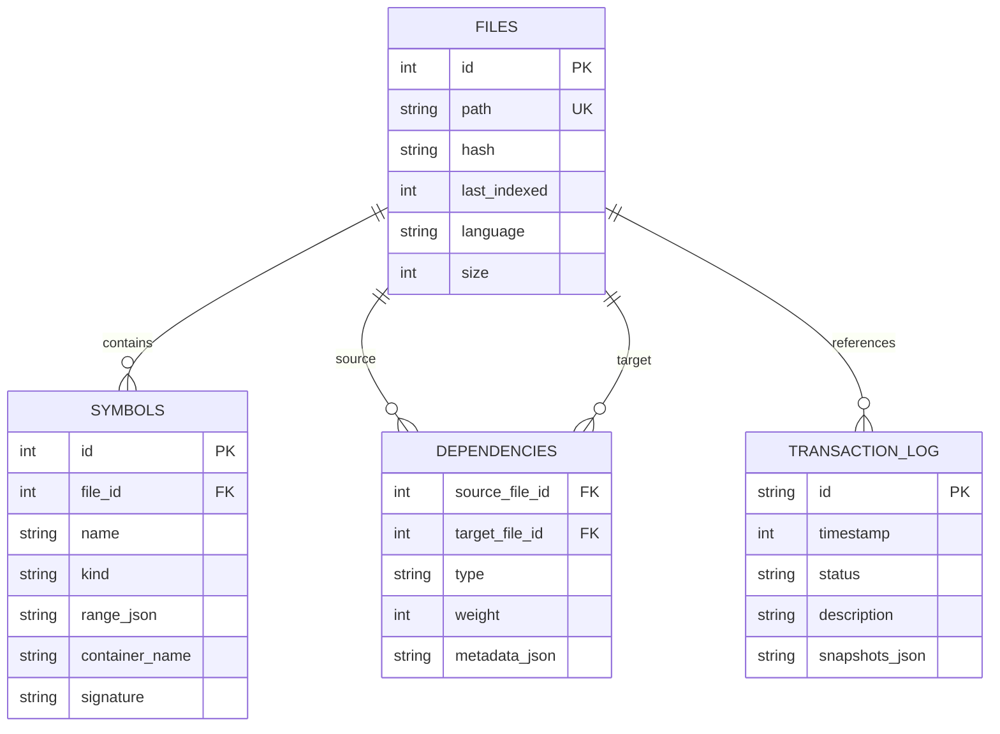

# Core Engine Internals

This document details the internal mechanisms of the Smart Context engine, specifically focusing on data structures, algorithms, and storage strategies. It consolidates the technical specifications from ADR-022 (Scalable Memory), ADR-018 (Cluster Search), and ADR-023 (Gap Remediation).

## 1. On-Disk Indexing (SQLite)

To support enterprise-scale codebases (1M+ lines of code), we cannot rely on in-memory structures. We persist all metadata in a local SQLite database (`.smart-context/index.db`) using `better-sqlite3`.

### 1.1 Database Schema (ADR-022/023)

The schema is normalized to minimize duplication while optimizing for graph traversal queries.

```sql
-- Files: Tracks file state, parsing status, and change detection
CREATE TABLE files (
    id INTEGER PRIMARY KEY AUTOINCREMENT,
    path TEXT UNIQUE NOT NULL,       -- Relative path (e.g., "src/index.ts")
    hash TEXT,                       -- xxHash64 of content for change detection
    last_indexed INTEGER,            -- Timestamp of last successful parse
    language TEXT,                   -- Language ID (e.g., "typescript")
    size INTEGER                     -- File size in bytes
);

-- Symbols: Definitions found in files (AST Extraction)
CREATE TABLE symbols (
    id INTEGER PRIMARY KEY,
    file_id INTEGER NOT NULL,
    name TEXT NOT NULL,              -- Symbol name (e.g., "EditorEngine")
    kind TEXT,                       -- "class", "function", "interface", "variable"
    range_json TEXT,                 -- { start: {line, col}, end: {line, col} }
    container_name TEXT,             -- Parent symbol (e.g., class name for a method)
    signature TEXT,                  -- Full signature for previews
    FOREIGN KEY(file_id) REFERENCES files(id) ON DELETE CASCADE
);
-- Indices optimized for Prefix Search (autocomplete) and Exact Lookup
CREATE INDEX idx_symbols_name ON symbols(name);
CREATE INDEX idx_symbols_file ON symbols(file_id);

-- Dependencies: The Connectivity Graph (Imports, Calls, Inheritance)
CREATE TABLE dependencies (
    source_file_id INTEGER,
    target_file_id INTEGER,
    type TEXT,                       -- "import", "export", "call", "implements"
    weight INTEGER DEFAULT 1,        -- Strength of the relationship (for ranking)
    metadata_json TEXT,              -- Extra info (e.g., call count, import alias)
    FOREIGN KEY(source_file_id) REFERENCES files(id) ON DELETE CASCADE,
    FOREIGN KEY(target_file_id) REFERENCES files(id) ON DELETE CASCADE
);
-- Indices optimized for Upstream/Downstream graph traversal
CREATE INDEX idx_deps_source ON dependencies(source_file_id);
CREATE INDEX idx_deps_target ON dependencies(target_file_id);

-- Transaction Log: Crash Recovery (ADR-023)
CREATE TABLE transaction_log (
    id TEXT PRIMARY KEY,             -- UUID
    timestamp INTEGER NOT NULL,
    status TEXT NOT NULL CHECK(status IN ('pending','committed','rolled_back')),
    description TEXT,
    snapshots_json TEXT NOT NULL     -- Compressed JSON of {path, originalContent, hash}
);
```

### 1.2 Indexing Strategy: Lazy + Streaming

We avoid the "Stop the World" indexing problem on startup.

1.  **Lazy Loading:**
    *   When `read_code(fileA)` is called, the system checks `files` table.
    *   If `last_indexed < fs.stat(fileA).mtime`, the file is parsed immediately (blocking for ~50ms).
    *   The DB is updated via an `UPSERT` operation.

2.  **Streaming Indexer:**
    *   A background worker iterates through all files in the project.
    *   It processes files in batches (e.g., 10 files) with an adaptive sleep interval (ADR-023 Debounce).
    *   This ensures the CPU usage stays low while eventually consistent.

3.  **Dirty Checking:**
    *   `chokidar` watches for file changes.
    *   Events (`add`, `change`) mark entries in the DB as dirty (or remove them from the cache).
    *   The next access triggers a re-parse.

---

## 2. Advanced Search Algorithms

### 2.1 Trigram Inverted Index (ADR-023)

For content search (`search_project` type="file") and fuzzy match pre-filtering, we use a Trigram index.

**Concept:**
Break text into sliding windows of 3 characters.
*   Text: `SmartContext`
*   Trigrams: `Sma`, `mar`, `art`, `rtC`, `tCo`, `Con`, `ont`, `nte`, `tex`, `ext`

**Implementation:**
*   **In-Memory Structure:** `Map<string, Set<FileID>>` (Trigram -> File List).
*   **Query Process:**
    1.  Convert Query `Context` -> Trigrams: `Con`, `ont`, `nte`, `tex`, `ext`
    2.  Fetch file lists for each trigram.
    3.  Perform **Jaccard Similarity** scoring on the sets.
    4.  Files with high intersection count are candidates.
*   **Performance:**
    *   Searching 10,000 files takes ~50ms.
    *   Used to optimize Levenshtein: Only run expensive edit-distance checks on files that share enough trigrams.

### 2.2 Context Cluster Engine (ADR-018)

When `type="auto"` is used, the engine builds "Context Clusters" instead of a flat list.

**Pipeline:**
1.  **QueryParser:** Extracts filters (`type:class`, `in:src/`) and search terms.
2.  **SeedFinder:** Identifies "Seed" symbols using the `SymbolIndex`.
    *   Matches are scored (Exact > Prefix > Fuzzy).
3.  **ClusterBuilder:** Expands seeds into clusters.
    *   **Co-located:** Symbols in the same file.
    *   **Callers/Callees:** Uses `CallGraphBuilder` (ADR-016) to find upstream/downstream nodes.
    *   **Type Family:** Uses `TypeDependencyTracker` to find interfaces/implementations.
    *   **ExpansionState:** Tracks whether a relationship is `loaded`, `loading`, or `truncated` (Lazy Expansion).
4.  **ClusterRanker:** Scores clusters based on:
    *   **Relevance:** How well the seed matches the query.
    *   **Density:** How interconnected the symbols are.
    *   **Centrality:** (PageRank-lite) Importance in the call graph.

---

## 3. AST Analysis & Skeleton Generation

We use **Tree-sitter** for robust parsing (ADR-010/011).

### 3.1 Skeleton Generation Logic
The goal is to show *structure* without *implementation* to save tokens.

**Traversal Logic:**
1.  Parse file to AST.
2.  Traverse tree looking for high-level nodes:
    *   `class_declaration` -> Extract name, heritage, decorators.
    *   `function_declaration` -> Extract name, params, return type.
    *   `method_definition` -> Extract visibility, static/async modifiers.
3.  **Fold Strategy:**
    *   If a node body is detected (`statement_block`), replace its content range with `{ ... }`.
    *   **Exception:** If a function is very short (< 5 lines), keep it (configurable via `detailLevel`).
    *   **Comments:** DocStrings (`/** ... */`) are preserved by default, but implementation comments (`// todo`) are stripped unless requested.

### 3.2 Symbol Resolution Fallback (ADR-026)
Resolving a string "User" to a specific symbol definition is complex. We use a **3-Tier Fallback Chain**:

1.  **Tier 1 (DB Index):**
    *   Query `SELECT * FROM symbols WHERE name = ?`.
    *   **Pros:** Fastest (~5ms).
    *   **Cons:** May be stale if file is currently being edited.

2.  **Tier 2 (Dirty Cache - AST):**
    *   If Tier 1 fails, check the `DirtyFile` set (recently modified files).
    *   Parse those files in-memory immediately using Tree-sitter.
    *   **Pros:** Always up-to-date.
    *   **Cons:** Slower (~50ms).

3.  **Tier 3 (Heuristic/Regex):**
    *   If AST parsing fails (e.g., syntax error), fall back to Regex patterns.
    *   Pattern: `class\s+User`, `function\s+User`.
    *   **Pros:** Works on broken code.
    *   **Cons:** Least accurate.

---

## 4. Analysis Modes

The `analyze_relationship` tool exposes internal graph traversals:

*   **`impact` (Forward Impact):**
    *   Algorithm: DFS (Depth-First Search) on `dependencies` table following `imported_by` edges.
    *   Answer: "If I change this file, who imports it?"
*   **`dependencies` (Backward Dependencies):**
    *   Algorithm: DFS on `imports` edges.
    *   Answer: "What does this file need to compile?"
*   **`calls` (Call Graph):**
    *   Algorithm: Uses `CallGraphBuilder` to resolve function calls within ASTs to `SymbolIndex` entries.
    *   Answer: "Who calls function X? Who does X call?"
*   **`data_flow` (Variable Tracing):**
    *   Algorithm: Uses Tree-sitter's `reference` query to track variable usage within a scope.
    *   Answer: "Where is this variable read or written?"

---

## 5. Real SQL Queries (IndexDatabase.ts)

### 5.1 Symbol Search

**Find all symbols matching a name (Prefix Search):**
```sql
SELECT s.id, s.name, s.kind, s.signature, f.path, s.range_json
FROM symbols s
JOIN files f ON s.file_id = f.id
WHERE s.name LIKE ? COLLATE NOCASE
ORDER BY s.name, f.path
LIMIT 50;
```

**Get all symbols in a specific file:**
```sql
SELECT id, name, kind, range_json, signature
FROM symbols
WHERE file_id = (SELECT id FROM files WHERE path = ?)
ORDER BY range_json -> 'start' -> 'line';
```

### 5.2 Dependency Graph Queries

**Find all files importing a specific file (Impact Analysis):**
```sql
WITH RECURSIVE impacted(file_id, depth) AS (
  SELECT target_file_id, 0 
  FROM dependencies 
  WHERE source_file_id = (SELECT id FROM files WHERE path = ?)
    AND type IN ('import', 'export')
  
  UNION ALL
  
  SELECT d.target_file_id, i.depth + 1
  FROM dependencies d
  JOIN impacted i ON d.source_file_id = i.file_id
  WHERE i.depth < 5
)
SELECT DISTINCT f.path, i.depth
FROM impacted i
JOIN files f ON i.file_id = f.id
ORDER BY i.depth, f.path;
```

### 5.3 Transaction Log Queries

**Find all uncommitted transactions (for crash recovery):**
```sql
SELECT id, description, snapshots_json
FROM transaction_log
WHERE status = 'pending'
ORDER BY timestamp DESC;
```

---

## 6. Database Schema ER Diagram



---

## 7. Performance Benchmarks

**Test Environment:** TypeScript project, 10,000 files, 500K+ symbols

### 7.1 Index Build Time

| Phase | Time | Notes |
|-------|------|-------|
| **Full Index Build** | 45-60s | Cold start, all files parsed |
| **Lazy Loading (per file)** | 50-150ms | Single file parse + DB insert |
| **Incremental Rebuild (10 files)** | 500-800ms | After file changes detected |
| **Database Vacuum** | 2-5s | Cleanup + optimization |

### 7.2 Query Latencies

| Query | P50 | P95 | Notes |
|-------|-----|-----|-------|
| **Symbol Search (by name)** | 5-20ms | 50-100ms | Indexed lookup |
| **Find Callers (impact, depth=3)** | 200-500ms | 800-1200ms | Recursive DFS |
| **Find Circular Dependencies** | 150-300ms | 600-900ms | Path validation |
| **Trigram Filtering (10K files)** | 50-100ms | 200-300ms | In-memory set ops |

### 7.3 Memory Usage

| Component | Usage | Scaling |
|-----------|-------|---------|
| **Symbol Index Cache** | 150-200MB | Linear with files |
| **Trigram Index** | 50-100MB | Linear with vocabulary |
| **LRU Query Cache** | 20-50MB | Fixed (LRU eviction) |
| **Active Transactions** | <10MB | Bounded by count |
| **Total (10K files)** | ~400MB | Acceptable for development |

---

## 8. Operational Procedures

### 8.1 Manual Index Corruption Recovery

**Symptom:** Index out of sync errors or missing search results.

**Recovery:**
```bash
# Backup current index
mv ~/.mcp/smart-context/index.db ~/.mcp/smart-context/index.db.backup

# Restart server (triggers full rebuild)
kill <server-pid>
<restart-server>

# Verify index is rebuilt
ls -lh ~/.mcp/smart-context/index.db
```

### 8.2 Database Maintenance

**Monthly optimization:**
```bash
sqlite3 ~/.mcp/smart-context/index.db
VACUUM;                                 -- Compact database
ANALYZE;                                -- Update index statistics
.quit
```

**Check Index Health:**
```bash
sqlite3 ~/.mcp/smart-context/index.db "PRAGMA integrity_check;"
```

### 8.3 Large Project Tuning

**For projects >100K files:**
```bash
export SMART_CONTEXT_PARSER_THREADS=8
export SMART_CONTEXT_CACHE_MB=1000
export SMART_CONTEXT_INDEX_INTERVAL=300000
```

---

## References

- ADR-022: Scalable Memory Architecture
- ADR-023: Enhanced Architectural Gap Remediation  
- ADR-018: Cluster-Based Contextual Search
- ADR-010/011: Tree-sitter AST Architecture
